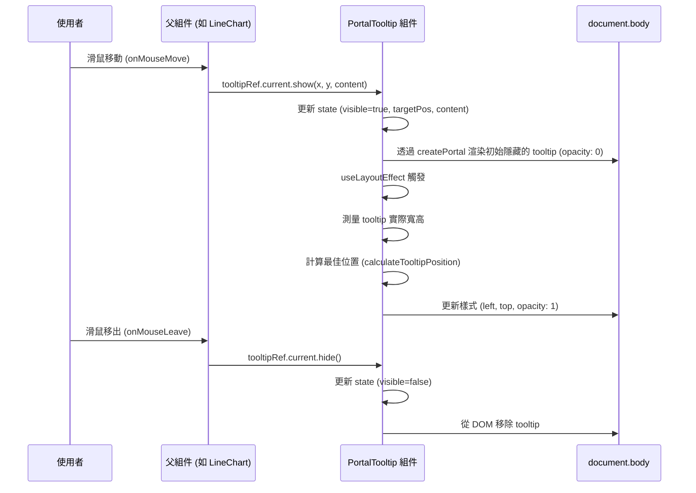

# PortalTooltip 組件規格書

## 1. 功能概述 (Overview)
`PortalTooltip` 是一個基於 React Portal 技術實作的全局提示框組件。它主要用於解決在複雜的 DOM 結構（如 SVG 圖表、具有 `overflow: hidden` 或 `z-index` 限制的容器）中，傳統 tooltip 容易被遮擋或截斷的問題。透過將 tooltip 的 DOM 節點直接掛載到 `document.body`，確保提示框始終顯示在最上層。

## 2. 技術實作 (Technical Implementation)
- **React Portal**: 使用 `ReactDOM.createPortal` 將組件渲染到 `document.body`，脫離原本的 DOM 樹層級。
- **Imperative Handle**: 透過 `forwardRef` 和 `useImperativeHandle` 暴露 `show` 和 `hide` 方法給父組件，允許父組件以指令式 (imperative) 的方式控制 tooltip 的顯示與隱藏，而不需要透過繁瑣的 state 傳遞。
- **動態定位**: 結合 `useLayoutEffect` 和自定義的 `calculateTooltipPosition` 工具函數，在 tooltip 內容渲染後（但尚未繪製到螢幕前）動態計算其寬高，並根據滑鼠座標 (`x`, `y`) 調整最佳顯示位置，避免超出視窗邊界。
- **效能優化**: 使用 `pointer-events-none` 確保 tooltip 不會干擾底層元素的滑鼠事件（如 `onMouseMove` 或 `onMouseLeave`）。

## 3. 屬性與方法 (Props & Methods)

### Props
| 屬性名稱 | 型別 | 必填 | 預設值 | 說明 |
| :--- | :--- | :--- | :--- | :--- |
| `className` | `string` | 否 | `''` | 允許傳入額外的 Tailwind CSS class 以自定義 tooltip 容器的樣式。 |

### Ref Methods (`TooltipHandle`)
父組件透過 `ref` 可以呼叫以下方法：
| 方法名稱 | 參數 | 說明 |
| :--- | :--- | :--- |
| `show` | `(x: number, y: number, content: React.ReactNode)` | 顯示 tooltip。需要傳入滑鼠的 clientX (`x`)、clientY (`y`) 以及要渲染的 React 節點 (`content`)。 |
| `hide` | `()` | 隱藏 tooltip。 |

## 4. UI/UX 排版設計 (UI/UX Design)
- **層級 (Z-Index)**: `z-[9999]` 確保在所有元素之上。
- **外觀**: 
  - 背景：`bg-slate-900/95` 帶有高透明度的深色背景。
  - 模糊效果：`backdrop-blur-md` 增加毛玻璃質感。
  - 邊框與圓角：`border border-slate-700 rounded-xl` 提供精緻的邊緣。
  - 陰影：`shadow-2xl` 增加立體感。
- **動畫**: `transition-opacity duration-150` 提供平滑的淡入淡出效果。

## 5. 模組依賴 (Dependencies)
- `react`: `useState`, `useImperativeHandle`, `forwardRef`, `useRef`, `useLayoutEffect`
- `react-dom`: `createPortal`
- `../../utils/tooltipUtils`: `calculateTooltipPosition` (用於計算邊界碰撞與最佳位置)

## 6. 使用範例 (Usage Example)
```tsx
import React, { useRef } from 'react';
import { PortalTooltip, TooltipHandle } from './ui/PortalTooltip';

const MyChartComponent = () => {
    const tooltipRef = useRef<TooltipHandle>(null);

    return (
        <div 
            onMouseMove={(e) => {
                tooltipRef.current?.show(e.clientX, e.clientY, (
                    <div>
                        <p className="font-bold">Tooltip 標題</p>
                        <p>數值: 12345</p>
                    </div>
                ));
            }}
            onMouseLeave={() => {
                tooltipRef.current?.hide();
            }}
        >
            {/* 圖表內容 */}
            <PortalTooltip ref={tooltipRef} />
        </div>
    );
};
```

## 7. 序列圖 (Sequence Diagram)

