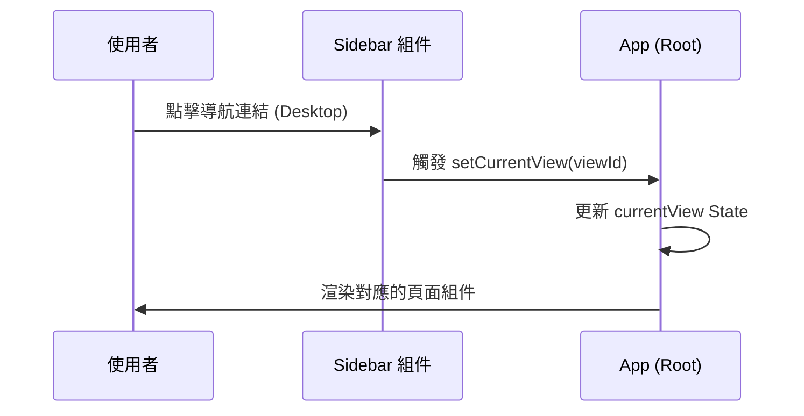

# 🧩 組件規格說明書 - 側邊導航欄 (Sidebar)

**撰寫日期**: 2026-03-24
**版本號**: 1.2.0

**文件代號**: `COMPONENT_SIDEBAR`
**檔案路徑**: `src/components/layout/Sidebar.tsx`
**主要用途**: 桌面版全域導航控制器，負責視圖切換、主題切換與選單收合。

---

## 1. 功能概述 (Feature Overview)

側邊欄是桌面版使用者在不同功能間切換的主要路徑。在手機版 (Width < 768px) 中會完全隱藏。

### 1.1 核心功能
*   **視圖導航**: 提供所有功能頁面的連結，點擊後切換 `src/App.tsx` 的 `currentView`。
*   **分組管理**: 依據功能性質將連結分組 (Categories)，支援折疊/展開各分組。
*   **響應式行為 (RWD)**:
    *   **Desktop (≥ 768px)**: 固定顯示。可切換「展開 (Expanded)」與「精簡 (Collapsed)」模式。
    *   **Mobile (< 768px)**: 透過 `hidden` CSS 類名完全隱藏，導航功能由 `MobileTabBar` 取代。
*   **主題切換**: 控制 Light/Dark Mode 的切換。

### 1.2 互動機制
*   **自動展開**: 當 `currentView` 改變時，側邊欄會自動展開該功能所屬的分組。
*   **Active State**: 當前所在的頁面連結會顯示高亮背景與左側指示條 (Indicator)。

---

## 2. 技術實作 (Technical Implementation)

### 2.1 導航結構 (Navigation Structure)
*   **外部配置**: `NAV_GROUPS` 定義移至 `src/config/navConfig.tsx` 供全域共享。
*   **資料內容**: 包含 5 個群組，每個群組定義了 `category` 名稱、代表色、以及子項目 `items`。
*   **Item 結構**: 包含 `id`, `label`, `icon`, `charColor`。

### 2.2 狀態管理
*   **`expandedGroups` (Set<string>)**: 追蹤目前展開的群組。
*   **`isCollapsed` (boolean)**: 控制側邊欄的寬度 (`w-60` vs `w-20`)。
*   **`theme`**: 切換全域的 `dark` class。

### 2.3 視覺邏輯
*   **精簡模式 (Collapsed)**:
    *   隱藏群組標題與 Item 文字。
    *   分組控制鎖定為展開狀態（視覺上）。
    *   Hover 時顯示原生 `title` 提示。
*   **自動滾動**: 內容區域使用 `flex-1 overflow-y-auto`，確保選單過長時可滾動。

---

## 3. UI/UX 排版設計 (UI Layout)

### 3.1 頂部品牌區 (Brand Header)
*   顯示 App Logo 與名稱。
*   點擊 Logo 可快速返回首頁 (`home`)。
*   精簡模式下僅顯示 Logo。

### 3.2 導航列表 (Nav List)
*   **群組標題**: 左側有色條標示群組顏色。
*   **連結項目**:
    *   **Normal**: 灰色文字，透明背景。
    *   **Active**: 淺灰色背景，文字高亮，左側出現對應角色 `charColor` 的指示條。

### 3.3 底部操作區 (Footer Actions)
*   **主題切換鈕**: 太陽/月亮圖示。
*   **收合控制鈕**: 切換側邊欄寬度（僅桌機版可用）。

---

## 4. 模組依賴 (Module Dependencies)

*   `src/components/layout/Sidebar.tsx`
*   `src/config/navConfig.tsx` (資料結構與資料來源)
*   `src/components/icons/TrophyIcon.tsx`
*   `src/config/uiText.ts`
*   `src/config/config/constants.ts` (引用 `CHARACTERS` 顏色)

---

## 5. 序列圖 (Sequence Diagram)

