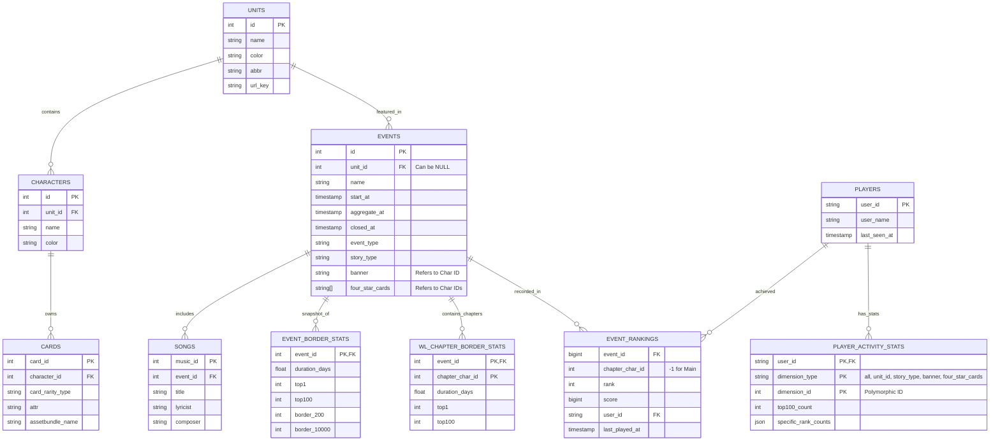

# 資料庫規格說明書 (DATABASE SCHEMA)

> **Document Name**: DATABASE_SCHEMA.md
> **Version**: v3.0.0
> **Date**: 2026-03-22

**文件代號**: `DATABASE_SCHEMA`
**主要用途**: 定義 HiSekaiTW 專案使用之 Supabase 資料庫的表格結構、欄位型別、約束條件與關聯關係。

---

---

## 2. 資料表詳細規格

### 2.1 `events` (活動資料表)
| 欄位名稱 | 型別 | 說明 |
| :--- | :--- | :--- |
| `id` | int | PK，活動 ID |
| `name` | string | 活動名稱 |
| `start_at` | timestamp | 活動開始時間 |
| `aggregate_at` | timestamp | 活動結算時間 |
| `closed_at` | timestamp | 活動結束時間 |
| `ranking_announce_at` | timestamp | 排名公佈時間 |
| `event_type` | string | 活動類型 |
| `unit_id` | int \| NULL | FK → `units.id`，可為 NULL |
| `story_type` | string | 故事類型 (`unit_event`, `mixed_event`, `world_link`) |
| `banner` | string | Banner 角色 ID（可帶尾碼如 `1-1`）|
| `four_star_cards` | string[] | 四星卡角色 ID 陣列（可帶尾碼）|
| `tag` | string | 活動標籤 |

### 2.2 `event_rankings` (排行榜明細表)
| 欄位名稱 | 型別 | 說明 |
| :--- | :--- | :--- |
| `event_id` | bigint | FK → `events.id` |
| `chapter_char_id` | int | `-1` = 一般排行榜；正整數 = World Link 角色章節 ID |
| `rank` | int | 名次 |
| `score` | bigint | 積分 |
| `user_id` | string | FK → `players.user_id` |
| `last_played_at` | timestamp | 最後遊玩時間 |
| `raw_user_card` | json | 原始裝扮卡資料 |

### 2.3 `players` (玩家資料表)
| 欄位名稱 | 型別 | 說明 |
| :--- | :--- | :--- |
| `user_id` | string | PK，玩家 ID |
| `user_name` | string | 玩家暱稱 |
| `last_seen_at` | timestamp | 最後被收錄時間 |

### 2.4 `player_activity_stats` (玩家五大維度統計表)

> **唯一約束 (Unique Constraint)**: `(user_id, dimension_type, dimension_id)`

| 欄位名稱 | 型別 | 說明 |
| :--- | :--- | :--- |
| `user_id` | string | PK (composite)，FK → `players.user_id` |
| `dimension_type` | string | PK (composite)，統計維度 (`all`, `unit_id`, `story_type`, `banner`, `four_star_cards`) |
| `dimension_id` | int | PK (composite)，維度對應 ID（`all` 固定為 `0`）|
| `top100_count` | int | 在此維度條件下進入前百名的總次數 |
| `specific_rank_counts` | json | 各名次的獲取次數，格式：`{ "1": N, "2": N, ... }` |
| `last_computed_at` | timestamp | 最後重新計算時間 |

**`dimension_type` 枚舉值說明：**
| 值 | `dimension_id` 意義 |
|---|---|
| `all` | 固定為 `0`，統計所有活動 |
| `unit_id` | 活動所屬的 `unit_id` 整數值（1~99）|
| `story_type` | `unit_event=1`, `mixed_event=2`, `world_link=3`, 未知=`99` |
| `banner` | 解析活動 `banner` 欄位後的角色 ID（去除尾碼）|
| `four_star_cards` | 各四星卡的角色 ID（去除尾碼），每張卡各自記一筆 |

> [!NOTE]
> 因部分活動的 `unit_id` 欄位為 `NULL`，`all` 維度的 `top100_count` 將**大於**所有 `unit_id` 維度的加總。此為預期行為，不屬於資料錯誤。

### 2.5 `event_border_stats` (活動分數線統計表)
| 欄位名稱 | 型別 | 說明 |
| :--- | :--- | :--- |
| `event_id` | int | PK，FK → `events.id` |
| `duration_days` | float | 活動天數 (2位小數)，計算依據 `aggregate_at - start_at` |
| `top1`~`top100` | int | 前百大之具體分數 |
| `border_200`~`border_10000` | int | 各排位之具體分數 |
| `computed_at` | timestamp | 最後重新計算時間 |

### 2.6 `wl_chapter_border_stats` (World Link 章節分數線統計表)
| 欄位名稱 | 型別 | 說明 |
| :--- | :--- | :--- |
| `event_id` | int | PK (composite)，FK → `events.id` |
| `chapter_char_id` | int | PK (composite)，WL 角色章節 ID |
| `duration_days` | float | 章節天數 |
| `top1`~`top100` | int | 前百大之具體分數 |
| `border_200`~`border_10000` | int | 各排位之具體分數 |
| `computed_at` | timestamp | 最後重新計算時間 |
