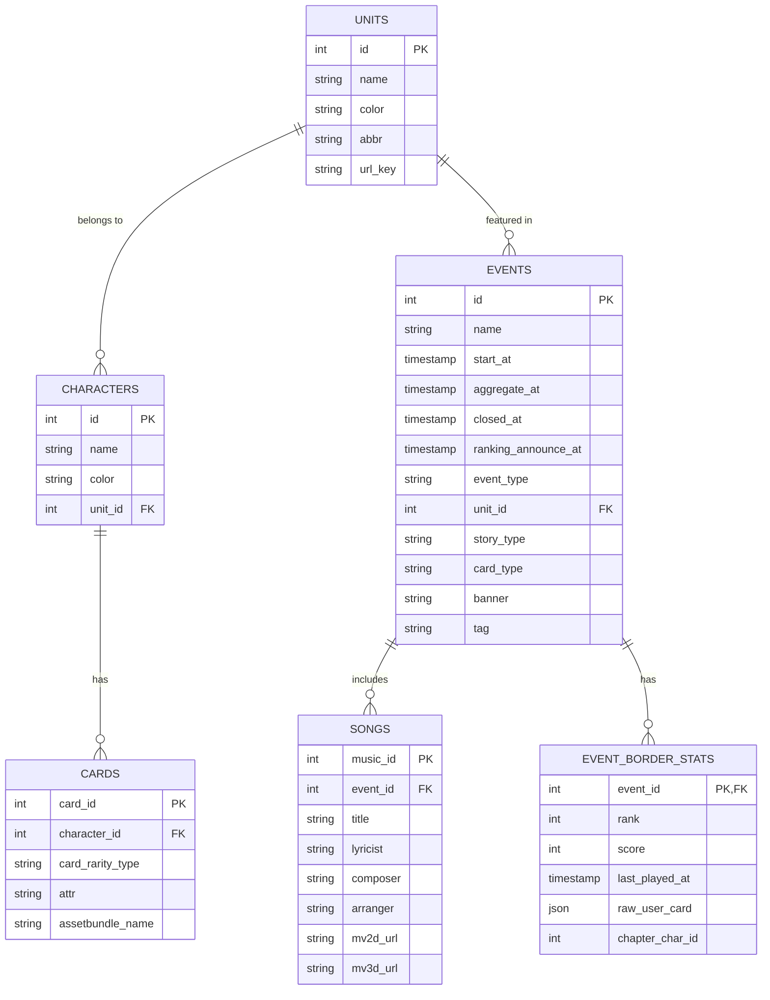

# 資料庫規格書 (DATABASE_SCHEMA)

**撰寫日期**: 2026-03-16
**版本號**: 2.0.0

本文件定義了 HiSekaiTW 專案所使用的 Supabase 資料庫結構。

## 1. 實體關聯圖 (ERD)

---

## 2. 資料表詳細規格

### 2.1 `units` (團體資料表)
| 欄位名稱 | 型別 | 說明 |
| :--- | :--- | :--- |
| `id` | int | 主鍵 (PK)，團體 ID |
| `name` | string | 團體名稱 |
| `color` | string | 代表色 (Hex) |
| `abbr` | string | 縮寫 |
| `url_key` | string | URL 識別鍵 |

### 2.2 `characters` (角色資料表)
| 欄位名稱 | 型別 | 說明 |
| :--- | :--- | :--- |
| `id` | int | 主鍵 (PK)，角色 ID |
| `name` | string | 角色名稱 |
| `color` | string | 代表色 (Hex) |
| `unit_id` | int | 外鍵 (FK)，對應 `units.id` |

### 2.3 `cards` (卡面資料表)
| 欄位名稱 | 型別 | 說明 |
| :--- | :--- | :--- |
| `card_id` | int | 主鍵 (PK)，卡面 ID |
| `character_id` | int | 外鍵 (FK)，對應 `characters.id` |
| `card_rarity_type` | string | 卡面稀有度類型 |
| `attr` | string | 屬性 |
| `assetbundle_name` | string | 資源包名稱 |

### 2.4 `events` (活動資料表)
| 欄位名稱 | 型別 | 說明 |
| :--- | :--- | :--- |
| `id` | int | 主鍵 (PK)，活動 ID |
| `name` | string | 活動名稱 |
| `start_at` | timestamp | 活動開始時間 |
| `aggregate_at` | timestamp | 活動結算時間 |
| `closed_at` | timestamp | 活動結束時間 |
| `ranking_announce_at`| timestamp | 排名公佈時間 |
| `event_type` | string | 活動類型 |
| `unit_id` | int | 外鍵 (FK)，對應 `units.id` |
| `story_type` | string | 故事類型 |
| `card_type` | string | 卡面類型 |
| `banner` | string | Banner 圖片路徑 |
| `tag` | string | 活動標籤 |

### 2.5 `songs` (歌曲資料表)
| 欄位名稱 | 型別 | 說明 |
| :--- | :--- | :--- |
| `music_id` | int | 主鍵 (PK)，音樂 ID |
| `event_id` | int | 外鍵 (FK)，對應 `events.id` |
| `title` | string | 歌曲名稱 |
| `lyricist` | string | 作詞 |
| `composer` | string | 作曲 |
| `arranger` | string | 編曲 |
| `mv2d_url` | string | 2D MV 連結 |
| `mv3d_url` | string | 3D MV 連結 |

### 2.6 `event_border_stats` (活動排名統計表)
| 欄位名稱 | 型別 | 說明 |
| :--- | :--- | :--- |
| `event_id` | int | 外鍵 (FK)，對應 `events.id` |
| `rank` | int | 排名 |
| `score` | int | 分數 |
| `last_played_at` | timestamp | 最後遊玩時間 |
| `raw_user_card` | json | 玩家卡面原始資料 |
| `chapter_char_id` | int | 章節角色 ID |
