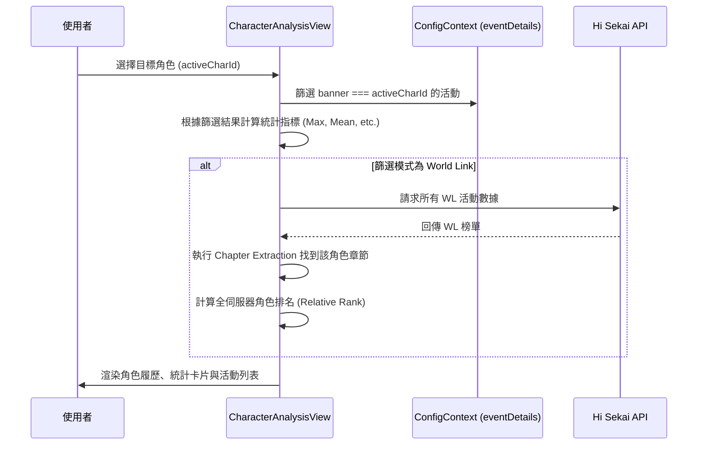

# 📄 頁面規格說明書 - 推角分析 (Character Analysis)

**撰寫日期**: 2026-03-11
**版本號**: 1.1.0

**文件代號**: `PAGE_CHARACTER_ANALYSIS`
**對應視圖**: `currentView === 'characterAnalysis'` (src/App.tsx)
**主要用途**: 以「角色 (Character)」為核心視角，分析該角色擔任 Banner (主角) 時的活動數據。

---

## 1. 功能概述 (Feature Overview)

本頁面專為「單推」玩家設計，提供角色的完整活動履歷。

### 1.1 核心功能
*   **視覺化角色選擇器**: 
    *   **Carousel 模式 (手機)**: 左右滑動切換角色。
    *   **Grid 模式 (桌機)**: 網格狀排列所有角色頭像。
*   **活動類型篩選**: 全部 / 箱活 / 混活 / World Link。
*   **World Link 特別模式**:
    *   當篩選為 WL 時，會自動切換為該角色在 WL 活動中的「個人章節排名」與「全伺服器角色排名」分析。
*   **個人活動紀錄列表**: 列出該角色擔任 Banner 的所有活動，並支援依「期數」或「分數」排序。
*   **立繪展示**: 桌機版左側會顯示該角色的精美立繪 (Full Art)。

### 1.2 統計指標
*   **活動計數**: 總擔任 Banner 次數。
*   **四星卡統計**: 計算該角色目前的四星卡總數（不含 FES/聯動，基於 `eventDetails` 推算）。
*   **分數統計**: Max, Mean, Median...

---

## 2. 技術實作 (Technical Implementation)

### 2.1 資料篩選邏輯
位於 `src/components/pages/CharacterAnalysisView.tsx`。

*   **一般模式**: 篩選 `eventDetails[id].banner === activeCharId`。
*   **WL 模式**: 
    *   讀取所有 WL 活動數據。
    *   從 `userWorldBloomChapterRankings` 中找到對應 `gameCharacterId` 的數據。
    *   計算該角色在所有角色中的相對排名 (Total Rank / Daily Rank)。

### 2.2 輪播互動 (Carousel Logic)
*   使用 `setInterval` 實現自動捲動效果。
*   `getVisibleChars`: 計算當前焦點角色的前後鄰居 (Prev 2, Next 2)，實現無限循環視覺效果。

### 2.3 資源管理
*   **圖片**: 大量使用 `getAssetUrl` 獲取頭像 (`character`), Q版圖 (`character_q`), 與立繪 (`character_full`)。

---

## 3. UI/UX 排版設計 (UI Layout)

### 3.1 頭部區域
*   **角色選擇器**: 背景使用模糊處理 (Blur) 營造層次感。
*   **資訊卡**: 顯示角色 Q 版圖片與動態生成的「推角報告」。

### 3.2 主內容區
*   **左側 (桌機限定)**: 角色全身立繪展示區。
*   **中間 (控制與統計)**: 
    *   下拉選單控制類型與名次。
    *   統計數據卡片堆疊。
*   **右側 (紀錄列表)**:
    *   卡片列表顯示每一期活動。
    *   WL 活動會額外標記「第 X 章」與「日均分」。

---

## 4. 模組依賴 (Module Dependencies)

*   `src/components/pages/CharacterAnalysisView.tsx`
*   `contexts/ConfigContext.ts`
*   `src/components/ui/Select.tsx`
*   `src/utils/mathUtils.ts`

## 5. 序列圖 (Sequence Diagram)

