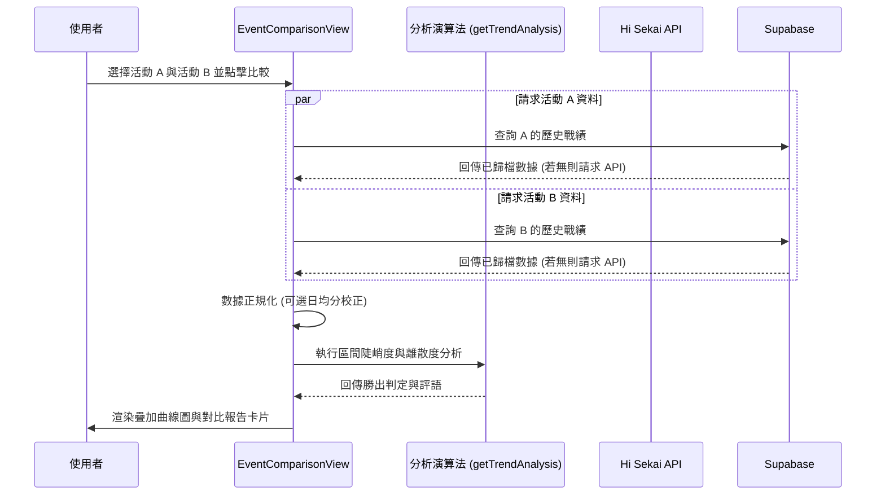

# 📄 頁面規格說明書 - 活動比較分析 (Event Comparison)

**撰寫日期**: 2026-03-16
**版本號**: 2.0.0

**文件代號**: `PAGE_EVENT_COMPARISON`
**對應視圖**: `currentView === 'comparison'` (src/App.tsx)
**主要用途**: 允許使用者並排比較任意兩期活動或 World Link 角色章節的榜單數據，分析分數膨脹趨勢與競爭型態差異。

---

## 1. 功能概述 (Feature Overview)

本頁面是資深玩家評估活動難度與預測分數線的重要工具，支援「一般活動」與「World Link」兩種截然不同的比較模式。

### 1.1 核心功能
*   **雙模式切換 (Mode Switcher)**:
    *   **一般活動比較**: 比較傳統的箱活、混活等。
    *   **World Link 比較**: 專門針對 World Link 活動，比較特定「輪次」與「角色」的個人章節榜單。
*   **獨立雙活動選取 (Dual Selection)**: 
    *   提供「活動 A (Base)」與「活動 B (Compare)」兩個獨立的選擇區塊。
    *   每個區塊擁有專屬的篩選器，互不干擾，方便跨團體、跨屬性進行精準比較。
*   **數據正規化 (Normalization)**:
    *   **總分模式**: 直接比較原始分數。
    *   **日均模式 (Daily Avg)**: 將分數除以活動天數 (或章節天數)，消除長度不同造成的偏差。
*   **疊加圖表**: 將兩者的分數曲線繪製於同一張圖表上 (X軸: 排名, Y軸: 分數)。
*   **自動化分析報告**:
    *   **陡峭度 (Steepness)**: 分析 T1-T10, T10-T100 等區間的斜率，判斷頭部競爭激烈程度。
    *   **平均分 (Avg Score)**: 比較整體分數水平。
    *   **勝出判定**: 系統自動標示哪一期/哪位角色在特定區間更為「卷」(競爭激烈)。

### 1.2 互動機制
*   **動態連動選單 (World Link 模式)**: 選擇「第 X 輪」後，「角色」下拉選單會自動過濾，僅顯示該輪次有出場的角色，避免無效選擇。
*   **鼠標追蹤 (Crosshair)**: 滑鼠在圖表移動時，自動吸附至最近的排名點，並透過 `PortalTooltip` 顯示兩者在該名次的具體分數，解決 tooltip 被 SVG 邊界截斷的問題。
*   **緊湊型過濾器 (Compact Filters)**: 一般模式下，使用 `EventFilterGroup` 的緊湊模式，將複雜的篩選條件收納於彈出選單中，保持畫面簡潔。

---

## 2. 技術實作 (Technical Implementation)

### 2.1 資料獲取 (Data Fetching)
位於 `src/components/pages/EventComparisonView.tsx` 的 `handleCompare` 函式。

*   **一般模式 (General)**:
    *   **歷史戰績**: 優先從 **Supabase** (`event_border_stats`) 查詢已歸檔的活動排名資料。
    *   **API 補強**: 若 Supabase 無資料，則發起對 Hi Sekai API 的請求。
*   **World Link 模式 (World Link)**:
    *   **歷史戰績**: 優先從 **Supabase** (`userWorldBloomChapterRankings`) 查詢已歸檔的 WL 章節排名資料。
    *   **API 補強**: 若 Supabase 無資料，則發起對 Hi Sekai API 的請求。
*   **數據合併**: 將 Top 100 詳細名單與 Border 概略名單合併、去重、排序，產生完整的 `SimpleRankData[]`。

### 2.2 圖表繪製邏輯 (Chart Logic)
*   **X軸變形 (Log-Linear Scale)**: 
    *   採用 **分段比例尺**: 前 30% 寬度顯示 T1-T100，後 70% 寬度顯示 T100-T10000 (使用對數縮放)，讓頭部排名更清晰。
*   **動態顏色 (Dynamic Colors)**: 
    *   一般活動使用 `getEventColor` 取得代表色。
    *   World Link 模式則直接讀取 `CHARACTERS` 常數，套用該角色的專屬應援色。

### 2.3 分析演算法 (Analysis Algorithm)
位於 `ChartDisplay` memo 中的 `getTrendAnalysis`。
*   將排名切分為 `[1-10]`, `[10-100]`, `[100-1000]`, `[1000+]` 四個區間。
*   計算每個區間的 **Spread (離散度)**: `(Max - Min) / Avg`。
*   根據 Spread 與 Average Score 的比值 (Ratio)，判定 A 或 B 勝出，並生成對應的評語 (動態帶入活動名稱或角色名稱)。

---

## 3. UI/UX 排版設計 (UI Layout)

### 3.1 頂部控制區 (Top Controls)
*   **模式切換鈕**: 左上角提供「一般活動比較」與「World Link 比較」的按鈕群組。
*   **開始比較鈕**: 右上角放置主要動作按鈕，載入時顯示 Loading 狀態。

### 3.2 選擇面板區 (Selection Panels)
*   **兩欄式佈局**: 左側為「活動 A (Base)」，右側為「活動 B (Compare)」。
*   **一般模式**:
    *   標題列右側放置「篩選條件」按鈕 (Compact Filter)。
    *   下方為活動下拉選單。
*   **World Link 模式**:
    *   提供「第幾輪」與「角色」兩個連動下拉選單。
    *   下方顯示唯讀的結果確認框 (例如：`#112 (第1輪) - 星乃一歌`)，明確提示當前選擇目標。

### 3.3 圖表與分析區 (Chart & Analysis Area)
*   **圖表標頭**: 顯示兩者的名稱、代表色點 (Legend) 與持續天數。
*   **繪圖區**: 使用 SVG 繪製兩條不同顏色的折線，虛線標示 X 軸的比例尺切換點。
*   **分析卡片**: 位於圖表下方，分為 4 個卡片，顯示競爭陡峭度、平均分數與系統評語。

---

## 4. 模組依賴 (Module Dependencies)

*   `src/components/pages/EventComparisonView.tsx` (獨立組件，內含圖表邏輯)
*   `src/lib/supabase.ts` (Supabase 客戶端)
*   `src/components/ui/Select.tsx`
*   `src/components/ui/EventFilterGroup.tsx` (提供獨立的篩選狀態)
*   `src/hooks/useRankings.ts` (複用 `fetchJsonWithBigInt`)
*   `src/utils/mathUtils.ts` (分數格式化)
*   `src/config/constants.ts` (引用 `CHARACTERS` 獲取角色顏色與名稱)

## 5. 序列圖 (Sequence Diagram)

