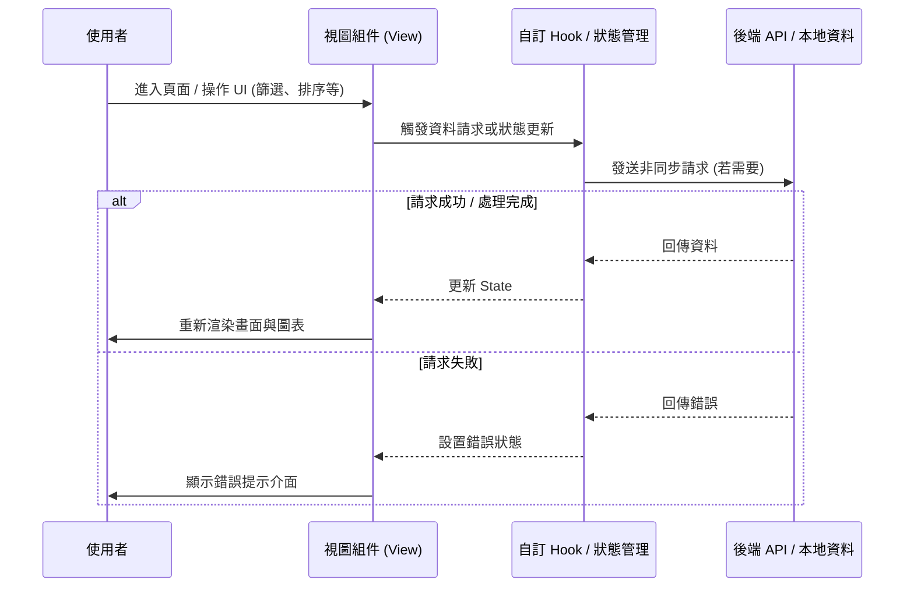

# 📄 頁面規格說明書 - 活動分布概況 (Event Distribution)

**撰寫日期**: 2026-03-11
**版本號**: 1.1.0

**文件代號**: `PAGE_EVENT_DISTRIBUTION`
**對應視圖**: `currentView === 'distribution'` (src/App.tsx)
**主要用途**: 以視覺化的時間軸（甘特圖）呈現活動歷史，分析角色與團體的活動密度、輪替規律與空窗期 (Gap)。

---

## 1. 功能概述 (Feature Overview)

本頁面提供宏觀的歷史數據視角，協助玩家預測未來的卡池與活動走向。

### 1.1 核心功能
*   **甘特圖時間軸 (Timeline Gantt Chart)**: 將所有歷史活動依月份排列，以長條圖顯示活動起訖時間。
*   **多層次篩選**:
    *   **類型篩選**: 全部 / 箱活 (Unit) / 混活 (Mixed) / World Link。
    *   **對象篩選**:
        *   **團體模式**: 顯示特定團體的所有相關活動。
        *   **角色模式**: 顯示特定角色擔任 Banner (主角) 的活動。
*   **統計儀表板**:
    *   計算選定對象的活動總數。
    *   **間隔分析 (Interval Analysis)**: 自動計算該角色/團體相鄰兩次活動間的「最小間隔天數」與「最大空窗期」。
*   **快速導航**: 點擊年份按鈕可快速捲動至該年度的時間軸位置。

### 1.2 互動機制
*   **懸停提示 (Tooltip)**: 滑鼠移至活動條上，透過 `PortalTooltip` 顯示該期活動的詳細資訊（Banner、屬性、卡池類型、Logo），避免被時間軸容器裁切。
*   **點擊切換**: 點擊篩選器中的角色頭像，可從「全覽模式」切換至「單一角色聚焦模式」。

---

## 2. 技術實作 (Technical Implementation)

### 2.1 資料處理 (Data Processing)
位於 `src/components/pages/EventDistributionView.tsx` 的 `monthlySegments` memo。

*   **網格化邏輯**: 系統將所有時間標準化為 **「每月 31 天」** 的虛擬網格，以簡化 CSS 排版。
*   **跨月處理**: 若活動跨越兩個月（例如 1/30 ~ 2/7），系統會將其切割為兩個 `MonthSegment`：
    *   段落 1: 1/30 ~ 1/31 (顯示於 1 月列)
    *   段落 2: 2/1 ~ 2/7 (顯示於 2 月列)
*   **座標計算**:
    *   `left`: `(開始日期 - 1) / 31 * 100%`
    *   `width`: `(持續天數) / 31 * 100%`

### 2.2 統計運算 (Stats Calculation)
位於 `stats` memo。
*   針對篩選後的活動列表，依 `startDate` 排序。
*   遍歷排序後的列表，計算 `events[i+1].start - events[i].start` 的天數差，找出 Max/Min 值。
*   區分「箱活間隔」與「混活間隔」分別統計，因為官方排程規律不同。

### 2.3 虛擬捲動 (Virtual Scrolling)
*   由於歷史活動長達數年，為了效能優化，僅渲染 `scrollIndex` 到 `scrollIndex + VIEWPORT_MONTHS (12)` 的月份 DOM 節點。
*   使用 `<input type="range">` 作為自定義捲軸控制器。

---

## 3. UI/UX 排版設計 (UI Layout)

### 3.1 控制面板 (Control Panel)
*   **頂部**: 標題與類型篩選按鈕 (Pills)。
*   **篩選區**:
    *   **左側 (Character)**: 角色頭像網格。選中時會有光環 (Ring) 與放大效果。
    *   **分隔線**: 視覺區隔。
    *   **右側 (Unit)**: 團體 Logo 列表。
    *   **邏輯**: 角色與團體篩選互斥，選中其一會自動重置另一個。

### 3.2 時間軸視圖 (Timeline View)
*   **年份導航**: 右上角一排年份按鈕 (2024, 2023...)。
*   **主圖表**:
    *   **Y軸 (月份)**: 2024/05, 2024/04... 由新到舊排列。
    *   **X軸 (日期)**: 1 ~ 31 的刻度。
    *   **活動條 (Bar)**: 
        *   顏色依據 Filter 狀態動態改變 (顯示團體色或角色代表色)。
        *   非篩選目標的活動會變灰階且半透明 (Ghosting)，保留背景脈絡但不搶眼。

### 3.3 統計摘要 (Summary Footer)
*   依據目前的篩選模式顯示不同資訊：
    *   **全覽模式**: 顯示 Unit/Mixed/WL 的總場數分佈。
    *   **角色模式**: 
        *   左側顯示該角色的 Unit/Mixed 場數。
        *   右側顯示 **間隔分析卡片** (Min/Max Days)，使用紅/綠色強調極端值。

---

## 4. 模組依賴 (Module Dependencies)

*   `src/components/pages/EventDistributionView.tsx` (核心組件)
*   `contexts/ConfigContext.ts` (讀取詳細設定)
*   `src/config/uiText.ts`
*   `src/utils/mathUtils.ts` (日期計算輔助)

## 5. 序列圖 (Sequence Diagram)

