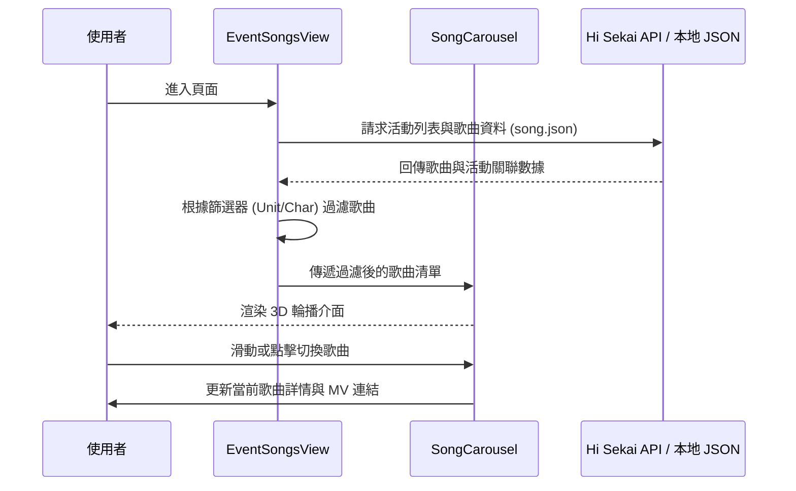

# 活動曲目及MV (Event Songs and MVs) 頁面規格書

**撰寫日期**: 2026-03-11
**版本號**: 1.1.0

## 1. 功能概述
「活動曲目及MV」頁面位於「工具 SEKAI」分類下，主要提供 Project Sekai 台服各期活動的關聯歌曲資訊。
使用者可以透過此頁面查詢各期活動的書下曲（或相關曲目），並以沉浸式的輪播介面瀏覽歌曲詳情、試聽片段及觀看 MV。

## 2. 資料依賴與處理
此頁面整合了多個資料來源：
*   **`src/data/song.json`**: 提供核心的歌曲資訊，包含 `songId`, `title`, `lyricist`, `composer`, `arranger`, `mv2d`, `mv3d`, `publishedAt`, `duration`, `bpm` 等。
*   **`src/data/eventDetail.json`**: 透過 `eventId` 關聯，取得該活動的所屬團體 (`unit`) 與 Banner 角色 (`banner`)。
*   **API `/event/list`**: 取得活動名稱與時間資訊。

## 3. UI/UX 排版與設計
*   **主題色**: 採用深色系 (Slate/Cyan) 風格，營造沉浸式體驗。
*   **頁面標頭**: 顯示大標題「活動曲目及MV」與說明文字。
*   **篩選與排序區塊**: 
    *   使用 `EventFilterGroup` 組件，提供團體、角色、屬性、類型等篩選條件。
    *   提供排序功能，支援依據上線時間、BPM、時長、Note數等進行排序。
*   **主要展示區**: 使用 3D 輪播 (Carousel) 組件 `SongCarousel` 展示歌曲卡片。

## 4. 篩選器與排序功能
提供多維度的篩選與排序功能：
1.  **團體 (Unit)**: 篩選特定團體的歌曲。
2.  **角色 (Character)**: 篩選特定角色參與的歌曲。
3.  **屬性 (Attribute)**: 篩選特定屬性（如 Cute, Cool 等）的歌曲。
4.  **類型 (Type)**: 篩選歌曲類型（如書下曲、翻唱曲等）。

**排序功能**:
*   支援多種排序依據：上線時間 (預設)、BPM、時長、Note數 (Easy/Normal/Hard/Expert/Master)。
*   支援升冪 (ASC) 與降冪 (DESC) 切換。

## 5. 歌曲卡片設計 (SongCard.tsx)

卡片採用響應式設計，根據裝置尺寸自動調整佈局：

**手機版 (直式佈局)**：
1.  **Header**：顯示歌曲名稱。
2.  **歌曲封面**：位於上方，保持正方形比例且不裁切，周圍保留邊距以顯示卡片框線感。
3.  **資訊按鈕**：位於封面圖右上角，點擊開啟詳細資訊遮罩。
4.  **活動 Banner**：位於封面圖下方，直接顯示。
5.  **MV 按鈕**：位於活動 Banner 下方。
6.  **詳細資訊遮罩**：開啟後覆蓋於卡片內容之上 (帶有毛玻璃背景)，顯示詳細資訊表格 (不含 Banner)。

**桌機版 (橫式佈局)**：
1.  **Header**：顯示歌曲名稱。
2.  **左側**：顯示歌曲封面。
3.  **右側**：
    *   上方：活動 Banner。
    *   中間：詳細資訊表格。
    *   下方：MV 按鈕 (2DMV / 3DMV)。

**視覺風格**：
*   **音箱風格**：卡片 Header 採用網格紋理，模擬音箱外觀。
*   **代表色應用**：團體名稱與 Banner 角色邊框使用官方代表色。
*   **深色模式**：完整支援深色模式，使用 Slate 色系作為基底。

## 6. 互動設計 (SongCarousel.tsx)

**導航方式**：
*   **桌機版**：
    *   **左右按鈕**：卡片兩側顯示大型箭頭按鈕。
    *   **鍵盤控制**：支援鍵盤左右方向鍵切換。
    *   **點擊卡片**：點擊兩側的卡片可直接切換至該卡片。
*   **手機版**：
    *   **滑動手勢**：支援左右滑動 (Swipe) 切換歌曲。
    *   **頂部預覽導航**：在卡片上方顯示「前一首」與「後一首」的小型封面預覽，點擊即可切換。
    *   **隱藏按鈕**：隱藏桌機版的左右箭頭按鈕，避免遮擋資訊。

**動畫效果**：
*   使用 `framer-motion` 實現流暢的切換動畫。
*   非作用中的卡片會自動縮小、降低透明度並向兩側位移，營造 3D 景深感。

## 7. 相關檔案
*   `src/components/pages/EventSongsView.tsx`: 頁面主組件。
*   `src/components/ui/SongCarousel.tsx`: 輪播組件。
*   `src/components/ui/SongCard.tsx`: 歌曲卡片組件。
*   `src/components/ui/EventFilterGroup.tsx`: 篩選器組件。

## 8. 序列圖 (Sequence Diagram)

