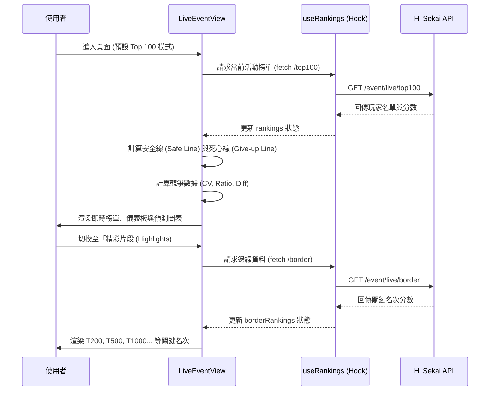

# 📄 頁面規格說明書 - 現時活動 (Live Event)

**撰寫日期**: 2026-03-11
**版本號**: 1.1.0

**文件代號**: `PAGE_LIVE_EVENT`
**對應視圖**: `currentView === 'live'` (src/components/pages/LiveEventView.tsx)
**主要用途**: 提供正在進行中的活動即時排名資訊、競爭數據分析與預測。

---

## 1. 功能概述 (Feature Overview)

本頁面是使用者進入應用程式後的第一個核心功能，旨在提供「戰場最前線」的即時資訊。

### 1.1 核心功能
*   **即時榜單查詢**: 顯示 Top 100 玩家的即時分數、名稱、隊伍資訊。
*   **World Link 章節切換**: 若當前活動為 World Link 類型，支援切換「總榜」與各角色的「個人章節」排行榜。
*   **角色頭像顯示**: 在排行榜中顯示玩家當前隊伍隊長卡片的 Q 版角色頭像 (Chibi Avatar)。
*   **精彩片段 (Highlights)**: 切換模式以查看特定名次（如 T200, T500, T1000, T2000, T5000, T10000）的分數線，而非連續的 1-100 名。
*   **倒數計時**: 顯示距離活動結算 (Aggregate At) 的剩餘時間。
*   **競爭數據儀表板**: 自動計算 T1/T10、T10/T50 等區間的分數倍率與差值，以及 T50-T100 的變異係數 (CV)，用以判斷競爭激烈程度。
*   **動態圖表**: 繪製分數分佈曲線，視覺化呈現排名斷層。
*   **安全線/死心線計算**:
    *   **安全線 (Safe Line)**: 根據剩餘時間，計算「理論上即使現在停止遊玩，被追上的機率極低」的分數門檻。
    *   **死心線 (Give-up Line)**: 計算「理論上即使現在開始以最高效率追趕，也無法超越」的分數門檻。

### 1.2 互動機制
*   **排序切換**: 支援依「總分」、「日均分」、「最後上線時間」及「時速 (1H/3H/24H)」排序。
*   **展開詳情**: 點擊單一玩家卡片，可展開查看詳細時速數據（過去 1/3/24 小時的場數、得分、平均分）。
*   **分頁控制**: 在 Top 100 模式下支援分頁瀏覽；在精彩片段模式下顯示關鍵名次。

---

## 2. 技術實作 (Technical Implementation)

### 2.1 資料來源 (Data Fetching)
本頁面主要依賴 `src/hooks/useRankings.ts` 進行資料管理。

| 資料類型 | API 端點 | 觸發時機 | 備註 |
| :--- | :--- | :--- | :--- |
| **Top 100 榜單** | `/event/live/top100` | 頁面載入時、切換分頁至一般模式時 | 回傳前 100 名完整資料 |
| **邊線榜單 (Borders)** | `/event/live/border` | 切換至「精彩片段」模式時、繪製圖表時 | 回傳特定名次 (200, 300...) 資料 |

### 2.2 核心邏輯 (Core Logic)

#### A. 安全線與死心線公式
位於 `src/components/shared/RankingItem.tsx` 與 `src/components/charts/ChartAnalysis.tsx`。

```typescript
const maxGainPerSec = 68000 / 100; // 假設極限理論值：每 100 秒獲得 6.8 萬分 (獨奏極限)
const maxGain = remainingSeconds * maxGainPerSec;

// 安全線：當前分數 + 剩餘時間理論最大增幅
const safeThreshold = currentScore + maxGain;

// 死心線：目標分數 - 剩餘時間理論最大增幅
const giveUpThreshold = targetScore - maxGain;
```

#### B. 競爭數據計算
位於 `src/components/pages/LiveEventView.tsx` 的 `competitiveStats` memo。
*   計算特定名次間的倍率 (Ratio) 與差值 (Diff)。
*   利用 `src/utils/mathUtils.ts` 計算變異係數 (CV)，數值越低代表分數分佈越平均（競爭越膠著）。

#### C. 狀態管理
*   **`useRankings`**: 封裝了 `fetch` 邏輯、錯誤處理、快取 (Cache) 機制。
*   **`currentPage`**: 控制顯示一般榜單 (number) 或是精彩片段 ('highlights')。

---

## 3. UI/UX 排版設計 (UI Layout)

頁面採用垂直流式佈局，由上而下分為三個主要區塊。

### 3.1 頁面頭部 (Header Section)
*   **標題**: 顯示「現時活動 (Live Event)」。
*   **活動資訊看板 (Event Header)**:
    *   採用響應式佈局 (Responsive Layout)。
    *   **手機與平板版 (Mobile & Tablet, < 1024px)**:
        *   採用垂直堆疊佈局 (Grid Layout)。
        *   **順序**:
            1.  **活動名稱** (Title)
            2.  **活動圖片** (Image)
            3.  **倒數計時器** (Countdown)
            4.  **最後更新時間** (Update Time)
            5.  **競爭數據** (Stats Display)
    *   **桌機版 (Desktop, >= 1024px)**:
        *   採用 Grid 佈局，橫向排列。
        *   **順序 (由左至右)**:
            1.  **活動圖片** (跨兩列)
            2.  **活動名稱** (上) / **最後更新時間** (下)
            3.  **倒數計時器** (跨兩列)
            4.  **競爭數據** (跨兩列，最右側)

### 3.2 圖表分析區 (Chart Section) - 可折疊
*   使用 `CollapsibleSection` 包覆。
*   **組件**: `ChartAnalysis.tsx` -> `LineChart.tsx`。
*   **視覺**:
    *   **X軸**: 排名 (Rank)。
    *   **Y軸**: 分數 (Score)。
    *   **輔助線**: 繪製「安全區 (綠色背景)」與「死心區 (紅色背景)」。
    *   **互動**: 懸停於圖表點可查看該名次的具體分數與玩家名稱。

### 3.3 排行榜列表區 (Ranking List Section) - 可折疊
*   使用 `CollapsibleSection` 包覆。
*   **控制列**:
    *   **分頁器 (`Pagination`)**: 1-20, 21-40... 以及「精彩片段」切換按鈕。
    *   **排序器 (`SortSelector`)**: 下拉選單選擇排序依據。
*   **列表內容 (`RankingList`)**:
    *   由多個 `RankingItem` 組成。
    *   **排名樣式**:
        *   **現時活動 (Live Event)**: 統一採用標準樣式，取消前三名的特殊皇冠與背景色，以保持介面整潔並突顯角色頭像。
        *   **歷代活動 (Past Events)**: 亦採用統一標準樣式，與現時活動保持一致。
    *   **卡片佈局**:
        *   **左**: 名次 (Rank)。
        *   **中**:
            *   **角色頭像 (Avatar)**: 顯示玩家隊長卡片的 Q 版角色圖 (Chibi)。透過 `cards.json` 將卡片 ID 轉換為角色 ID。
            *   **玩家名稱**: 粗體文字，若過長則截斷顯示。
            *   **ID**: 隱藏/縮小顯示 (User ID displayed below).
        *   **右**: 主要分數數據 (依排序依據變化)。
            *   **分數顯示**: 一般情況採用 `text-base` (行動版) 至 `text-lg` (桌機版)；若顯示安全/死心線則統一為 `text-base` 以容納更多資訊。
            *   **輔助資訊**: 僅在分數排序時，於分數旁顯示安全線/死心線提示。
    *   **展開詳情**: 點擊後向下滑出，顯示 1H / 3H / 24H 的詳細數據卡片 (次數/得分/時速/平均)。

---

## 4. 模組依賴 (Module Dependencies)

### 4.1 資料來源 (Data Fetching)
*   **Top 100 榜單**: `/event/live/top100`
*   **邊線榜單 (Borders)**: `/event/live/border`
*   **外部資源**:
    *   **卡片對照表**: `cards.json` (GitHub Raw)
    *   **角色圖片**: `Chibi/{characterId}.png` (GitHub Raw)

### 4.2 狀態管理
*   **`useRankings`**: 管理榜單數據與快取。
*   **`cardService`**: 管理卡片資料的獲取與快取 (`useCardData`)。

*   `src/components/pages/LiveEventView.tsx` (主容器)
*   `src/components/shared/RankingList.tsx`
*   `src/components/shared/RankingItem.tsx`
*   `src/components/shared/StatsDisplay.tsx`
*   `src/components/charts/ChartAnalysis.tsx`
*   `src/components/charts/LineChart.tsx`
*   `src/components/ui/Pagination.tsx`
*   `src/components/ui/SortSelector.tsx`
*   `src/components/ui/CollapsibleSection.tsx`
*   `src/components/ui/EventHeaderCountdown.tsx`
*   `src/components/ui/CountdownTimer.tsx`
*   `src/hooks/useRankings.ts`
*   `src/utils/mathUtils.ts` (計算 CV, 格式化分數)
*   `src/config/uiText.ts` (多語言文案引用)

## 5. 序列圖 (Sequence Diagram)



