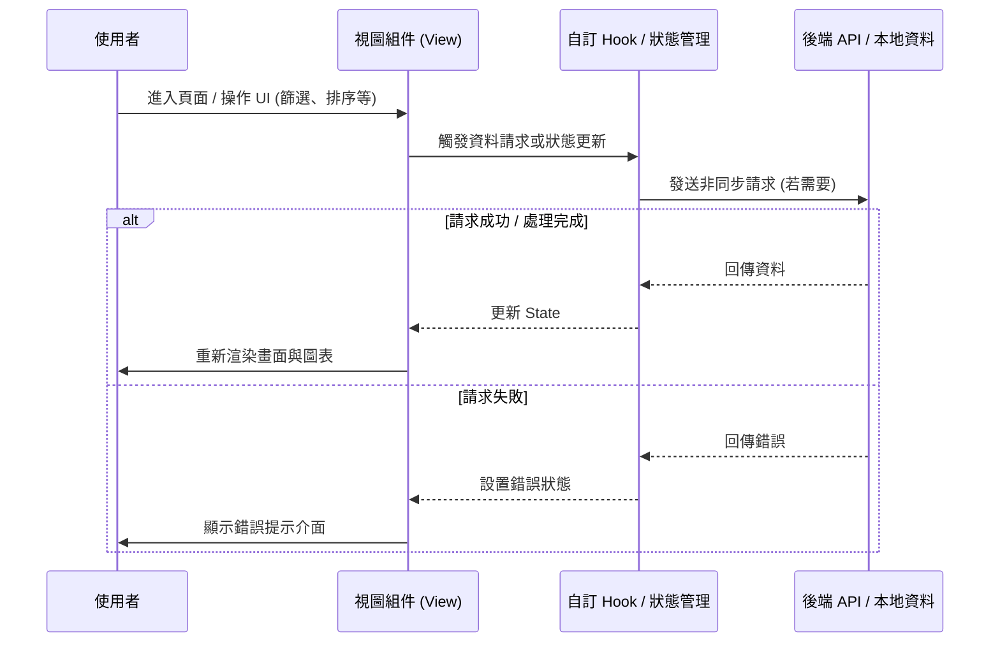

# 📄 頁面規格說明書 - MySekai 採集計算機 (MySekai Mining)

**撰寫日期**: 2026-03-11
**版本號**: 1.1.0

**文件代號**: `PAGE_MYSEKAI_MINING`
**對應視圖**: `currentView === 'mySekaiMining'` (src/App.tsx)
**主要用途**: 針對遊戲內「MySekai」模式的採集機制，提供收益預估、目標規劃與樹木砍伐模擬器。

---

## 1. 功能概述 (Feature Overview)

本頁面將複雜的採集公式封裝為直觀的計算器，協助玩家最大化活動 Pt 收益。

### 1.1 核心功能
*   **全域設定 (Global Settings)**:
    *   輸入「隊伍綜合力」與「活動加成 (%)」。
    *   系統自動查表判斷「階層 (Tier)」與「基礎分 (Base Pt)」。
*   **正向計算 - 收益預估 (Yield Estimation)**:
    *   輸入採集物數量（花朵、掉落物、樹木）。
    *   計算總獲得 Pt 與總消耗體力。
    *   **進階樹木模擬器 (Adv. Sim)**: 模擬對一顆 20 HP 的樹使用不同工具的過程，計算精確的 Pt 與體力消耗（含 Leave-2 機制）。
*   **反向計算 - 目標規劃 (Target Planning)**:
    *   輸入「目標 Pt」。
    *   提供三種策略建議：
        1.  **標準完整採集**: 最省體力，樹打完不夠再補花。
        2.  **分段採集 (Hit & Run)**: 針對樹木只打前兩下即離開（高效率但高消耗），計算所需樹木量。
        3.  **單一工具速刷**: 模擬全程使用同一工具的懶人模式。

---

## 2. 技術實作 (Technical Implementation)

### 2.1 基礎分模型 (Base Pt Model)
位於 `src/components/pages/MySekaiMiningView.tsx` 的 `getBasePt`。
*   依據綜合力區間 (0 ~ 40萬+) 劃分為 Tier 1 ~ Tier 9。
*   對應基礎分範圍：450 ~ 800 Pt。

### 2.2 樹木模擬邏輯 (Tree Simulator Logic)
*   **機制**: 一顆樹/礦石視為 **20 HP**。
*   **工具傷害**: 
    *   普通: 4 dmg
    *   不錯: 5 dmg
    *   最強: 7 dmg
    *   電鋸: 8 dmg
*   **Leave-2 規則 (尾刀保護)**: 
    *   若當前 HP > 2，且單次傷害會導致 HP < 2，則系統強制鎖血在 2 HP（需再補一刀）。
    *   模擬器完整實作此狀態機，準確計算動作數與溢出傷害。

### 2.3 策略演算法
*   **Standard**: 優先使用「完整樹木 (1.0火)」填補目標分，剩餘殘分由「花朵 (0.2火)」補足。
*   **Partial (Hit & Run)**:
    *   假設對象為無限供應的樹。
    *   電鋸策略: 每棵樹只打 2 下 (16 HP)，消耗 0.8 火。
    *   最強斧策略: 每棵樹只打 2 下 (14 HP)，消耗 0.7 火。
    *   此模式不考慮「擊破獎勵」或「單位捨入」，以純傷害換算 Pt。

---

## 3. UI/UX 排版設計 (UI Layout)

### 3.1 全域設定卡 (Global Card)
*   深色背景區塊，輸入綜合力與加成。
*   即時顯示計算出的 **Base Pt** 與 **Tier**，讓玩家確認落點。

### 3.2 雙欄功能區
*   **左側 (收益預估)**:
    *   列出三種採集物（花/閃光/樹）的輸入框。
    *   **Advanced Sim 面板**: 可展開的互動區域。
        *   視覺化 HP 條 (20格)。
        *   工具按鈕矩陣：點擊加入佇列，即時扣血並計算 Pt。
        *   Undo/Reset 功能。
*   **右側 (目標規劃)**:
    *   輸入目標 Pt。
    *   策略選擇器 (Standard / Partial / SingleTool)。
    *   **動態結果卡**: 依據選擇的策略，顯示不同的建議（例如：「需 50 棵樹 + 3 朵花」或「需電鋸均傷 200 棵樹」）。
    *   **Live Bonus 換算**: 將總消耗火數換算為大小罐圖示。

---

## 4. 模組依賴 (Module Dependencies)

*   `src/components/pages/MySekaiMiningView.tsx` (全邏輯內聚)
*   `src/components/ui/Card.tsx`
*   `src/components/ui/Input.tsx`
*   `src/components/ui/Select.tsx`
*   `src/config/config/constants.ts` (工具圖示路徑)

## 5. 序列圖 (Sequence Diagram)

