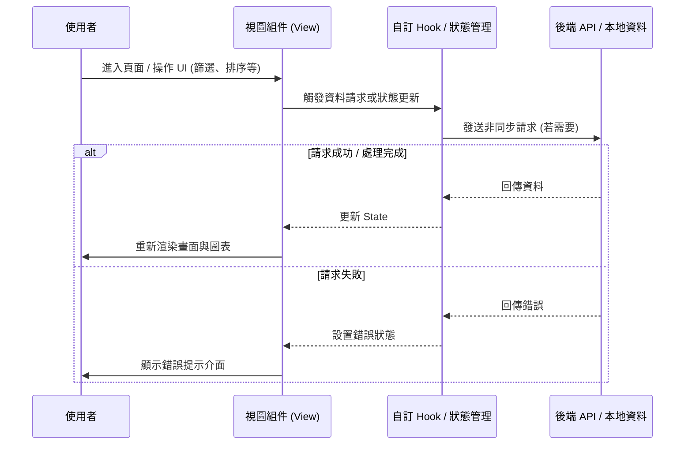

# 📄 頁面規格說明書 - 活躍玩家分析 (Active Player Analysis)

**撰寫日期**: 2026-03-11
**版本號**: 1.1.0

**文件代號**: `PAGE_PLAYER_ANALYSIS`
**對應視圖**: `currentView === 'playerAnalysis'` (src/App.tsx)
**主要用途**: 透過掃描歷代活動榜單，識別出伺服器中上榜次數最多的「活躍玩家」與「特定名次常客」。

---

## 1. 功能概述 (Feature Overview)

本頁面回答「誰是台服最強的玩家？」或「誰最常拿到 Top 10？」等問題，揭示伺服器的高端玩家生態。

### 1.1 核心功能
*   **全期數大數據掃描**: 系統自動抓取自開服以來所有活動的 Top 100 數據。
*   **Top 100 常客排行**: 統計每位玩家進入前百名的總次數。
    *   **前百霸榜率**: 顯示玩家上榜次數佔總期數的百分比。
*   **特定名次常客**:
    *   透過下拉選單選擇 Rank 1 ~ Rank 10。
    *   統計每位玩家獲得該「特定名次」的次數（例如：誰拿過最多次 Rank 1）。
*   **團體偏好標籤**: 在玩家名稱旁顯示該玩家曾上榜過的團體標籤 (Unit Tags)，分析其「主推」傾向。

### 1.2 互動機制
*   **批次進度回饋**: 由於數據量龐大，介面提供即時進度條與「暫停/繼續」控制鈕。
*   **即時重排**: 當掃描進度更新時，排行榜會即時重新計算並排序。

---

## 2. 技術實作 (Technical Implementation)

### 2.1 資料聚合邏輯 (Aggregation Logic)
位於 `src/components/pages/PlayerAnalysisView.tsx`。

1.  **隊列初始化**: 取得所有 `closed_at < now` 的活動列表，建立 `eventsQueue`。
2.  **批次請求**: 
    *   每次處理 `BATCH_SIZE = 5` 個活動。
    *   使用 `AbortController` 確保組件卸載時中斷請求。
3.  **統計表更新**:
    *   維護一個巨大的 `playerStats: Record<string, PlayerStat>` 物件。
    *   Key 為 `userId` (確保唯一性)。
    *   遍歷榜單時：
        *   `top100Count++`
        *   若 `rank <= 15`，更新 `specificRankCounts`。
        *   更新 `unitCounts` (依據該期活動的 Unit 屬性)。
        *   更新 `latestName` (以最新的活動名稱為準)。

### 2.2 效能優化
*   **記憶體管理**: 僅儲存必要的統計數據，而非保留原始榜單陣列。
*   **Memoization**: 使用 `useMemo` 處理排序與過濾（`topFrequent100`, `topFrequentSpecific`），避免 React Render Cycle 造成卡頓。

---

## 3. UI/UX 排版設計 (UI Layout)

### 3.1 狀態與控制區
*   **標題**: 顯示總掃描期數。
*   **進度面板**: 
    *   顯示百分比、已處理期數。
    *   動態進度條 (Cyan color)。
    *   暫停/繼續按鈕。

### 3.2 雙榜單佈局 (Split View)
*   **左側 (Top 100 常客)**:
    *   顯示累計次數最多的前 15 名玩家。
    *   **團體標籤**: 使用 `flex-wrap` 顯示該玩家打過的所有團體縮寫 (LN, MMJ, etc.)，依次數排序。
    *   **前百霸榜率**: 顯示玩家上榜次數佔總期數的百分比。
*   **右側 (特定名次常客)**:
    *   **Header Action**: 嵌入一個 `Select` 下拉選單，讓使用者切換目標名次 (T1-T10)。
    *   顯示該名次獲取次數最多的玩家。

---

## 4. 模組依賴 (Module Dependencies)

*   `src/components/pages/PlayerAnalysisView.tsx`
*   `src/components/ui/DashboardTable.tsx`
*   `src/components/ui/Select.tsx`
*   `contexts/ConfigContext.ts` (用於判斷活動團體屬性)
*   `src/hooks/useRankings.ts`

## 5. 序列圖 (Sequence Diagram)

