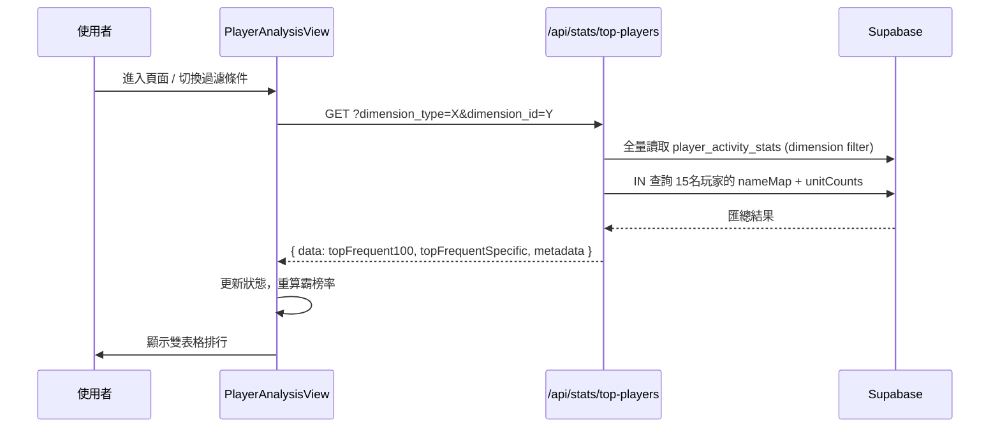

# 📄 頁面規格說明書 - 活躍玩家分析 (Active Player Analysis)

> **Document Name**: PAGE_PLAYER_ANALYSIS.md
> **Version**: v2.0.0
> **Date**: 2026-03-22

**文件代號**: `PAGE_PLAYER_ANALYSIS`
**對應視圖**: `currentView === 'playerAnalysis'` (src/App.tsx)
**主要用途**: 透過掃描歷代活動榜單，識別出伺服器中上榜次數最多的「活躍玩家」與「特定名次常客」，並支援五大維度過濾。

---

## 1. 功能概述 (Feature Overview)

本頁面回答「誰是台服最強的玩家？」或「誰最常拿到 Top 10？」等問題，揭示伺服器的高端玩家生態。

### 1.1 核心功能
*   **Top 100 常客排行**: 統計每位玩家進入前百名的總次數，並顯示**前百霸榜率**（上榜次數 ÷ 已結束活動總期數）。
*   **特定名次常客**: 透過下拉選單選擇 Rank 1 ~ Rank 10，統計每位玩家獲得該特定名次的次數。
*   **團體偏好標籤**: 玩家名稱旁顯示其曾上榜的各團體圖示（Unit Icons），按次數由高至低排序，分析「主推」傾向。
*   **五大維度過濾**: 透過 `EventFilterGroup` (exclusive mode) 支援以下過濾條件：
    - **全部 (all)**: 預設，不過濾。
    - **特定 Unit**: 篩選某一組合的活動榜單。
    - **特定 Banner 角色**: 篩選該 Banner 角色出演的活動。
    - **特定四星卡角色**: 篩選有該角色四星卡的活動。

### 1.2 互動機制
*   切換過濾條件後，前端觸發 `useEffect` 重新向後端請求對應維度的統計資料。
*   `totalEventsCount` 同步根據前端已結束活動的篩選結果更新，作為霸榜率的精準分母。

---

## 2. 技術實作 (Technical Implementation)

### 2.1 資料聚合來源

本頁面的排行結果均來自後端預計算好的 `player_activity_stats` 表（五大維度），無需即時聚合。

### 2.2 API 端點

`GET /api/stats/top-players?dimension_type={type}&dimension_id={id}`

**Query Parameters:**
| 參數 | 說明 | 範例 |
|---|---|---|
| `dimension_type` | 統計維度 | `all`, `unit_id`, `banner`, `four_star_cards` |
| `dimension_id` | 維度 ID | `0`(all), `1`(LN), `2`(MMJ)... |

**回傳格式：**
```json
{
  "data": {
    "topFrequent100": [ ...15筆格式化玩家統計... ],
    "topFrequentSpecific": {
      "1": [...], "2": [...], ..., "10": [...]
    }
  },
  "metadata": {
    "totalTop100": 8246,
    "rankCounts": { "1": 124, "2": 218, ... }
  }
}
```

### 2.3 前端維度對映邏輯 (`PlayerAnalysisView.tsx`)

```
filters.unit !== 'all'      → dimension_type=unit_id,    dimension_id=filters.unit
filters.banner !== 'all'    → dimension_type=banner,      dimension_id=filters.banner
filters.fourStar !== 'all'  → dimension_type=four_star_cards, dimension_id=filters.fourStar
(其餘)                       → dimension_type=all,         dimension_id=0
```

### 2.4 霸榜率分母計算邏輯

前端透過 `/api/event/list` 取得完整活動清單，然後依照同一套過濾條件（`unit_id`、`banner`、`fourStar`）過濾出**已結束**的活動，以過濾後的活動數量作為霸榜率的分母。如此確保「篩選 Unit 1」時，分母是 Unit 1 已結束的期數而非總期數。

### 2.5 後端 API 實作 (`server.ts` → `/api/stats/top-players`)

1.  **全量載入**: 以 `while + .range()` 分頁讀取資料庫中目標維度的所有玩家統計。
2.  **記憶體切片**: 在應用層排序後取前 15 名，避免大量 SQL 運算。
3.  **二次精準查詢**: 以 `user_id IN (...)` 批次抓取前 15 名的玩家暱稱與各 Unit 的上榜次數。
4.  **組裝 JSON**: 格式化後回傳，`players.user_name` 以 `nameMap` 補齊。

---

## 3. UI/UX 排版設計 (UI Layout)

### 3.1 頁眉區 (Header)
*   標題 + 過濾後的已結束活動期數（作為評估基準提示）。
*   `EventFilterGroup`（exclusive mode，僅可選擇一個條件）。

### 3.2 雙榜單佈局 (Split View)
*   **左側 (Top 100 常客)**:
    *   欄位：排名 / 玩家名稱 & 團體標籤 / 上榜次數 / 前百霸榜率 (%)。
    *   顯示前 15 名。
*   **右側 (特定名次常客)**:
    *   Header Action 嵌入 `Select` 下拉選單 (T1~T10)。
    *   欄位：排名 / 玩家名稱 & 團體標籤 / 獲取次數。

---

## 4. 模組依賴 (Module Dependencies)

*   `src/components/pages/PlayerAnalysisView.tsx`
*   `src/components/ui/DashboardTable.tsx`
*   `src/components/ui/Select.tsx`
*   `src/components/ui/EventFilterGroup.tsx` (exclusive mode)
*   `src/hooks/useRankings.ts` (`fetchJsonWithBigInt`)
*   `src/config/constants.ts` (`UNITS`, `API_BASE_URL`)
*   `src/utils/gameUtils.ts` (`getAssetUrl`)
*   後端: `server.ts` → `/api/stats/top-players`

---

## 5. 序列圖 (Sequence Diagram)


