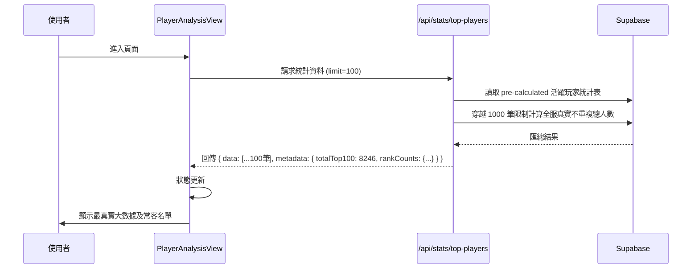

# 📄 頁面規格說明書 - 活躍玩家分析 (Active Player Analysis)

**撰寫日期**: 2026-03-13
**版本號**: 1.2.0

**文件代號**: `PAGE_PLAYER_ANALYSIS`
**對應視圖**: `currentView === 'playerAnalysis'` (src/App.tsx)
**主要用途**: 透過掃描歷代活動榜單，識別出伺服器中上榜次數最多的「活躍玩家」與「特定名次常客」。

---

## 1. 功能概述 (Feature Overview)

本頁面回答「誰是台服最強的玩家？」或「誰最常拿到 Top 10？」等問題，揭示伺服器的高端玩家生態。

### 1.1 核心功能
*   **全期數大數據掃描**: 系統自動從 Supabase 資料庫抓取自開服以來所有活動的 Top 100 數據。
*   **Top 100 常客排行**: 統計每位玩家進入前百名的總次數。
    *   **前百霸榜率**: 顯示玩家上榜次數佔總期數的百分比。
*   **特定名次常客**:
    *   透過下拉選單選擇 Rank 1 ~ Rank 10。
    *   統計每位玩家獲得該「特定名次」的次數（例如：誰拿過最多次 Rank 1）。
*   **團體偏好標籤**: 在玩家名稱旁顯示該玩家曾上榜過的團體標籤 (Unit Tags)，分析其「主推」傾向。

### 1.2 互動機制
*   **即時重排**: 由於改用 Supabase 單次查詢，資料載入極快，載入完成後排行榜會立即計算並顯示。

---

## 2. 技術實作 (Technical Implementation)

### 2.1 資料聚合邏輯 (Aggregation Logic)
位於 `src/components/pages/PlayerAnalysisView.tsx` 與 `api/stats/top-players.ts`。

1.  **後端預計算**: 歷史排行榜結算透過 GitHub Actions 執行 (`scripts/cron-runner.ts`)，批次統計並回寫入 `player_activity_stats` (包含 top100 計數與 specific ranks JSON 物件)。
2.  **單次 API 請求**: 
    *   前端向 `/api/stats/top-players?unit_id=0&limit=100` 發起請求。
3.  **大數據分頁 (Paging Metadata)**:
    *   後端除了回傳 limit 制訂的常客名單，也會透過 `while (range(0, 999))` 穿越 Supabase 的 1000 行限制。
    *   回傳格式：`{ data: PlayerStat[], metadata: { totalTop100, rankCounts } }`。
4.  **精確還原全服總數**:
    *   前端不使用名單長度 (100) 做為「總人數」，而是精確拔取 `metadata.totalTop100` (如：8,246 人) 來呈現最真實的高端玩家總量。

### 2.2 效能優化
*   **資料庫查詢快取**: 藉由 `player_activity_stats` 統計快取表，將原來在前端需合併處理數十萬筆的歷史資料，縮減成直接返回已匯總完成的精華 Top 100，頁面載入速度 <100ms。
*   **突破分頁限制**: 後端藉由分頁匯總為 `metadata`，解決傳統清單無法計算全服不重複人數的問題。
*   **Memoization**: 使用 `useMemo` 處理排序與過濾（`topFrequent100`, `topFrequentSpecific`），避免 React Render Cycle 造成卡頓。

---

## 3. UI/UX 排版設計 (UI Layout)

### 3.1 狀態與控制區
*   **標題**: 顯示總掃描期數。
*   **進度面板**: 
    *   顯示載入中狀態 (Processing)。

### 3.2 雙榜單佈局 (Split View)
*   **左側 (Top 100 常客)**:
    *   顯示累計次數最多的前 15 名玩家。
    *   **團體標籤**: 使用 `flex-wrap` 顯示該玩家打過的所有團體縮寫 (LN, MMJ, etc.)，依次數排序。
    *   **前百霸榜率**: 顯示玩家上榜次數佔總期數的百分比。
*   **右側 (特定名次常客)**:
    *   **Header Action**: 嵌入一個 `Select` 下拉選單，讓使用者切換目標名次 (T1-T10)。
    *   顯示該名次獲取次數最多的玩家。

---

## 4. 模組依賴 (Module Dependencies)

*   `src/components/pages/PlayerAnalysisView.tsx`
*   `src/components/ui/DashboardTable.tsx`
*   `src/components/ui/Select.tsx`
*   `contexts/ConfigContext.ts` (用於判斷活動團體屬性)
*   `src/hooks/useRankings.ts`
*   `src/lib/supabase.ts` (Supabase 客戶端)

## 5. 序列圖 (Sequence Diagram)

