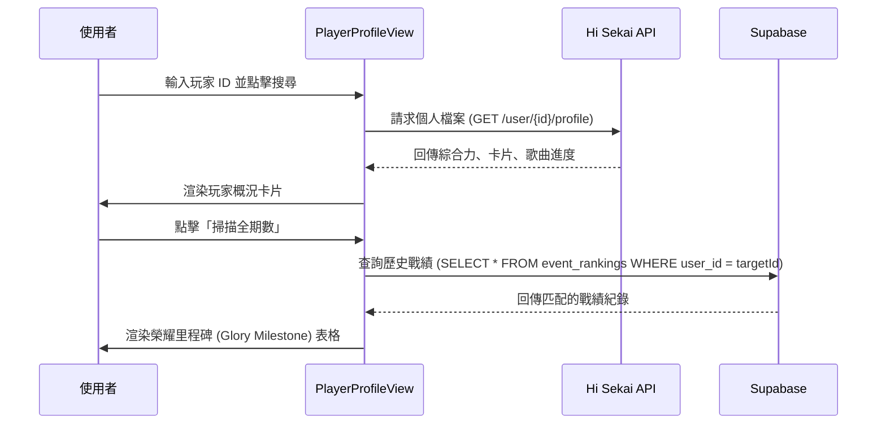

# 📄 頁面規格說明書 - 玩家狀態查詢 (Player Profile)

**撰寫日期**: 2026-03-16
**版本號**: 2.0.0

**文件代號**: `PAGE_PLAYER_PROFILE`
**對應視圖**: `currentView === 'playerProfile'` (src/App.tsx)
**主要用途**: 針對單一玩家 ID 進行深度查詢，展示其綜合力組成、歌曲通關進度以及歷史活動的戰績。

---

## 1. 功能概述 (Feature Overview)

本頁面是個人的「履歷表」或「戰績卡」。

### 1.1 核心功能
*   **ID 查詢**: 輸入遊戲 ID，獲取即時的個人檔案。
*   **綜合力分析**: 拆解 Total Power 的來源（卡片基礎、區域道具、角色等級、稱號加成等）。
*   **榮耀里程碑 (Glory Milestone)**: 
    *   **全期數掃描**: 按下掃描鈕後，系統會從 Supabase 資料庫中快速查詢該玩家曾經進入 Top 100 的所有紀錄。
    *   **排序與分頁**: 支援依「期數」或「分數」排序掃描結果。
*   **角色等級檢視**: 顯示玩家持有的各角色等級 (Character Rank)。
*   **歌曲進度**: 顯示各難度 (Easy ~ Append) 的 Clear / FC / AP 數量。

---

## 2. 技術實作 (Technical Implementation)

### 2.1 資料來源
*   **個人檔案**: `/user/{userId}/profile` (Hi Sekai API)。
*   **歷史戰績**: `event_rankings` (Supabase)。
    *   **實作方式**: 前端發起單次 Supabase 查詢，直接篩選 `user_id` 符合目標玩家的紀錄。
    *   **過濾**: 透過 `.is('chapter_char_id', null)` 確保只抓取活動總榜分數。
    *   **狀態**: 使用 `isScanning` 呈現掃描進度（由於改用 Supabase，掃描過程通常在毫秒級完成）。

### 2.2 視覺化呈現
*   **Clamp Font Size**: 針對玩家名稱過長的情況，使用 CSS `clamp()` 動態縮小字體，確保不跑版。
*   **Grid Layout**: 使用 CSS Grid 排列角色等級與歌曲數據，確保 RWD 適應性。

---

## 3. UI/UX 排版設計 (UI Layout)

### 3.1 頂部搜尋與概況
*   **輸入框**: 支援 Enter 鍵觸發搜尋。
*   **概況卡片 (Profile Card)**:
    *   頂部顯示玩家名稱、ID、Rank。
    *   右側顯示 Total Power (綠色高亮)。
    *   下方顯示 6 個屬性的綜合力拆解 (Power Breakdown)。

### 3.2 左右雙欄佈局
*   **左側 (榮耀里程碑)**:
    *   未掃描時顯示「掃描全期數」按鈕。
    *   掃描後顯示表格：期數、活動 Logo、活動名稱、名次 (前三名高亮)、分數。
    *   表格上方有排序控制鈕。
*   **右側 (詳細數據)**:
    *   **角色等級**: 依團體分組顯示所有角色的圓形頭像與等級。
    *   **歌曲數據**: 顯示各難度的 CLR/FC/AP 統計矩陣。

---

## 4. 模組依賴 (Module Dependencies)

*   `src/components/pages/PlayerProfileView.tsx`
*   `src/components/ui/Card.tsx`
*   `src/components/ui/Button.tsx`
*   `src/hooks/useEventList.ts` (用於取得掃描目標列表)
*   `src/hooks/useRankings.ts` (fetchJsonWithBigInt)
*   `src/lib/supabase.ts` (Supabase 客戶端)

## 5. 序列圖 (Sequence Diagram)

