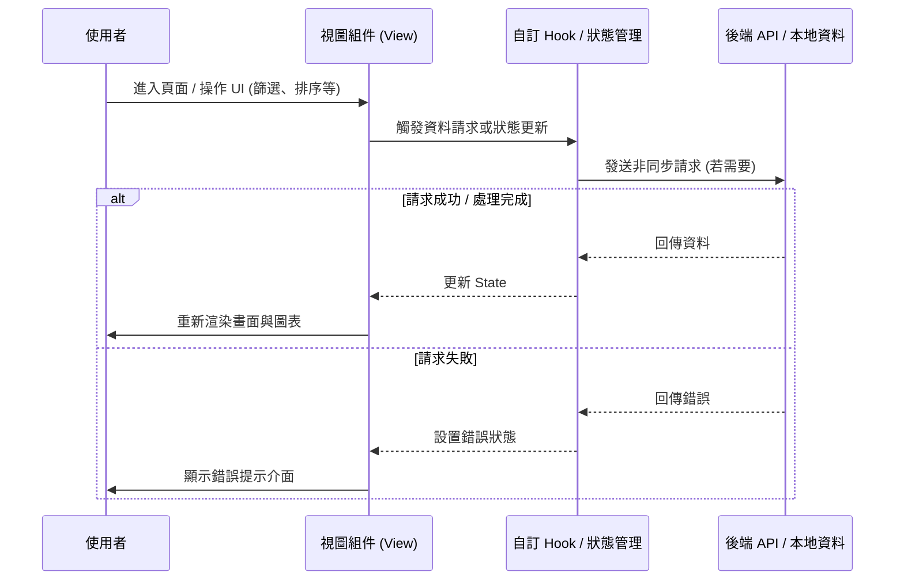

# 📄 頁面規格說明書 - 玩家排名結構 (Player Structure)

**撰寫日期**: 2026-03-11
**版本號**: 1.1.0

**文件代號**: `PAGE_PLAYER_STRUCTURE`
**對應視圖**: `currentView === 'playerStructure'` (src/App.tsx)
**主要用途**: 透過數學模型分析前百名玩家的「換血率 (Turnover Rate)」，剖析遊戲生態的流動性與固化程度。

---

## 1. 功能概述 (Feature Overview)

本頁面運用 `U(K)` 曲線模型，將抽象的「競爭生態」轉化為視覺化圖表。

### 1.1 核心指標：排名生態曲線 U(K)
*   **定義**: 計算在前 `K` 名 (Rank 1...K) 的區間內，不重複玩家的比例。
*   **公式**: $U(K) = \frac{\text{Unique Players in Rank } 1..K}{N \times K} \times 100\%$
    *   $N$: 統計的活動總期數。
    *   $K$: 目前考察的名次 (1 ~ 100)。
*   **解讀**:
    *   **數值高**: 代表該名次區間「人人有機會」，流動性高。
    *   **數值低**: 代表該名次區間「總是同一群人」，階級固化。

### 1.2 核心功能
*   **多維度篩選**:
    *   **全域 (Global)**: 分析所有活動。
    *   **團體 (Unit)**: 僅分析特定團體的箱活。
    *   **角色 (Character)**: 
        *   **Banner 模式**: 僅分析該角色當 Banner 的活動。
        *   **四星模式**: 分析該角色有出四星卡的活動。
*   **趨勢分析**: 自動計算 T1-T10, T10-T50, T50-T100 的斜率變化，判斷生態擴張或萎縮。
*   **解讀指南 (Interpretation Guide)**: 內建教科書式的說明面板，解釋圖表意義。

---

## 2. 技術實作 (Technical Implementation)

### 2.1 客戶端運算 (Client-side Calculation)
位於 `src/components/pages/PlayerStructureView.tsx`。

*   **排除機制**: 自動排除 `World Link` 活動，因為其榜單結構不同，會汙染 `U(K)` 計算。
*   **集合運算**:
    *   建立 100 個 `Set<string>`，分別對應 Rank 1 到 Rank 100。
    *   遍歷 $N$ 期活動的榜單。
    *   若玩家 $P$ 在某期獲得 Rank $R$，則將 $P$ 加入 $Set[R-1]$ 到 $Set[99]$ 的**所有集合中**（因為獲得第 1 名也等於進入了前 5 名）。
    *   最終 $U(K) = Set[K-1].size / (N * K)$。

### 2.2 SVG 繪圖
*   使用原生 SVG `<path>` 繪製曲線。
*   **互動游標**: 滑鼠移動時，計算最近的 $K$ 值，並透過 `PortalTooltip` 顯示該點的具體數值與趨勢標籤，確保 tooltip 不會被 SVG 容器遮擋。
*   **動態縮放**: Y 軸設定為 40% ~ 100%，以放大曲線差異。

---

## 3. UI/UX 排版設計 (UI Layout)

### 3.1 左側控制面板
*   **模式切換**: Banner / FourStar 按鈕群。
*   **篩選器矩陣**:
    *   Unit Grid: 5 個團體 Logo。
    *   Character Grid: 26 個角色頭像。
    *   支援「多選」與「全域疊加」邏輯。
*   **解讀指南**: 像卡片一樣可翻頁的教學區塊，解釋「正趨勢」、「負趨勢」等名詞。

### 3.2 右側圖表區
*   **主圖表**: 
    *   背景顯示 40% - 100% 的網格線。
    *   曲線顏色對應團體或角色的主題色。
    *   全域 (Global) 曲線預設顯示為灰色，作為基準參考。
*   **頂部數據列**: 顯示目前的統計期數 ($N$) 以及各區間的趨勢斜率。
*   **公式提示**: 點擊 `?` 按鈕可彈出數學公式說明。

---

## 4. 模組依賴 (Module Dependencies)

*   `src/components/pages/PlayerStructureView.tsx` (全邏輯內聚)
*   `contexts/ConfigContext.ts`
*   `src/hooks/useRankings.ts`
*   `src/utils/mathUtils.ts`

## 5. 序列圖 (Sequence Diagram)

