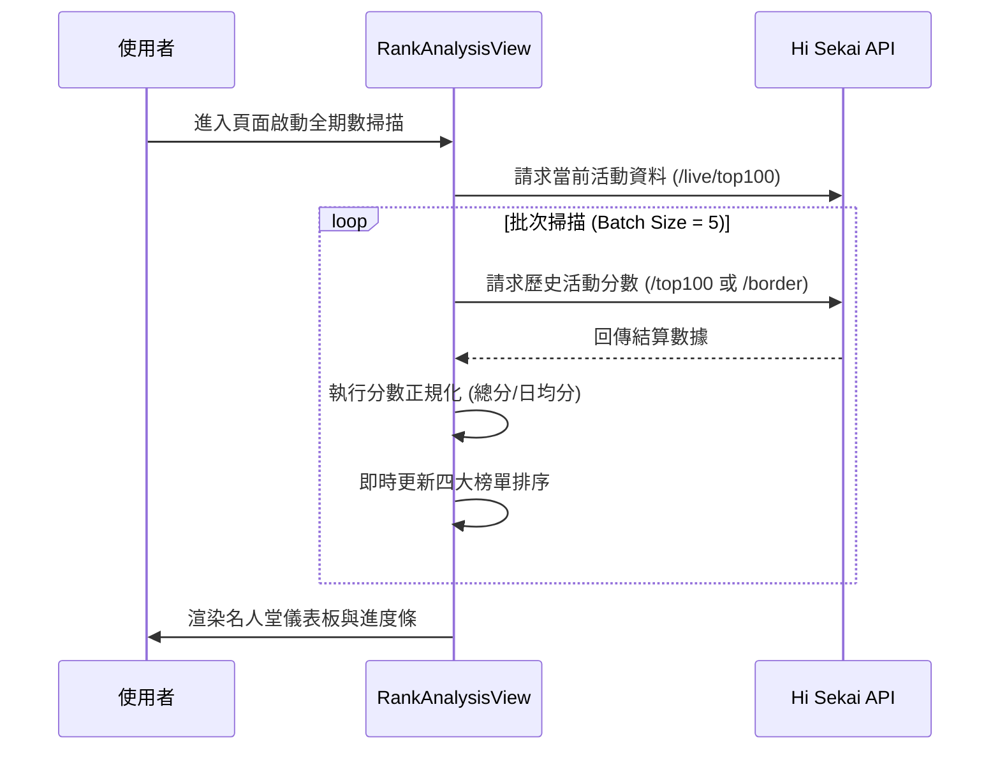

# 📄 頁面規格說明書 - 活動榜線排名 (Rank Analysis)

**撰寫日期**: 2026-03-11
**版本號**: 1.1.0

**文件代號**: `PAGE_RANK_ANALYSIS`
**對應視圖**: `currentView === 'analysis'` (src/App.tsx)
**主要用途**: 統計並列出歷代活動中，各個關鍵名次（T1, T10, T100, Border）的最高分數紀錄，猶如「名人堂」般的數據展示。

---

## 1. 功能概述 (Feature Overview)

本頁面旨在回答「哪一期活動的分數線最高？」或「哪一期的競爭最激烈？」等問題。

### 1.1 核心功能
*   **全期數掃描**: 系統自動掃描所有已結束（及進行中）的活動數據。
*   **四大榜單儀表板**: 同時展示四個維度的排名：
    *   **Top 1**: 頂點分數排行。
    *   **Top 10**: 頭部玩家門檻排行。
    *   **Top 100**: 百名牌位線排行。
    *   **自訂邊線 (Custom Border)**: 透過下拉選單切換 T200, T1000, T10000 等大眾名次。
*   **日均分模式 (Daily Average Mode)**: 
    *   由於早期活動天數較短（約 7 天），近期活動較長（約 9-11 天），單純比較總分失準。
    *   提供切換按鈕，將分數除以活動天數，進行標準化比較。
*   **進階篩選**: 支援針對特定團體、屬性、卡池類型進行過濾，例如「只看 VBS 箱活的 Top 100 排名」。

### 1.2 互動機制
*   **暫停/繼續**: 由於掃描歷代活動需要發送大量 API 請求，介面提供暫停按鈕，讓使用者中止數據載入。
*   **即時排序**: 表格內容會隨著數據載入即時更新並重新排序。

---

## 2. 技術實作 (Technical Implementation)

### 2.1 資料處理策略 (Data Fetching Strategy)
位於 `src/components/pages/RankAnalysisView.tsx` 的 `useEffect`。

*   **批次請求 (Batch Processing)**:
    *   為避免觸發 API Rate Limit 或造成瀏覽器卡頓，系統將所有歷史活動以 `BATCH_SIZE = 5` 為一組進行分批處理。
    *   使用 `Promise.all` 並行處理每一批次的 5 個活動。
    *   **並發控制**: 每一批次完成後，才會進行下一批次。
*   **即時狀態更新**: 每完成一批次，立即使用 `setProcessedStats` 更新 State，讓使用者看到進度條 (`loadingProgress`) 與部分結果，而非空白畫面。
*   **中斷機制 (Abort Controller)**:
    *   組件卸載 (Unmount) 或使用者點擊暫停時，觸發 `abortController` 或 `alive` 旗標，停止後續的 API 請求。

### 2.2 核心邏輯
*   **分數正規化**:
    *   總分模式: 直接使用 API 回傳的 `score`。
    *   日均模式: `Math.ceil(score / Math.max(0.1, duration))`。
    *   **例外處理**: 若活動時長異常（小於 0.1 天），設為最小值以防除以零。
*   **現時活動整合**: 
    *   除了歷史活動，系統會額外請求 `/event/live/top100`，將正在進行中的活動數據也納入比較（標記為 "進行中" 並顯示剩餘天數）。

---

## 3. UI/UX 排版設計 (UI Layout)

### 3.1 控制與進度區 (Control Panel)
*   **標題與篩選**: 左側顯示標題，右側包含 `EventFilterGroup` (收闔式篩選按鈕與彈跳視窗) 與「總分/日均」切換按鈕 (Toggle Group)。
*   **進度條 (Progress Bar)**:
    *   僅在 `isAnalyzing` 為真時顯示。
    *   包含文字提示：「正在同步分析數據... (XX%)」與「已處理: XX / Total」。
    *   右側懸浮「暫停/繼續」按鈕。

### 3.2 儀表板網格 (Dashboard Grid)
*   採用 RWD Grid 佈局：手機 1 欄 -> 平板 2 欄 -> 桌機 4 欄。
*   每個區塊為一個 `DashboardTable` 組件：
    *   **Header**: 標題與對應顏色的背景條 (Top 1 黃色, Top 10 紫色, Top 100 青色, Border 藍綠色)。
    *   **自訂下拉選單**: 第四個表格標題旁嵌入 `Select` 組件，用於切換 Border Rank。
    *   **列表內容**:
        *   顯示前 10 名活動。
        *   **Row 樣式**: 排名 1-3 使用金/銀/銅色高亮數字。
        *   **活動資訊**: 顯示活動名稱、ID、天數。若為進行中活動，顯示動態標籤。
        *   **分數欄**: 依據模式顯示總分或日均分，靠右對齊，使用等寬字體 (Monospace)。

---

## 4. 模組依賴 (Module Dependencies)

*   `src/components/pages/RankAnalysisView.tsx` (核心視圖)
*   `src/components/ui/DashboardTable.tsx` (通用排名表格)
*   `src/components/ui/EventFilterGroup.tsx`
*   `src/components/ui/Select.tsx`
*   `src/hooks/useRankings.ts` (fetchJsonWithBigInt)
*   `src/utils/mathUtils.ts` (計算日期與分數格式化)
*   `contexts/ConfigContext.ts`

## 5. 序列圖 (Sequence Diagram)

