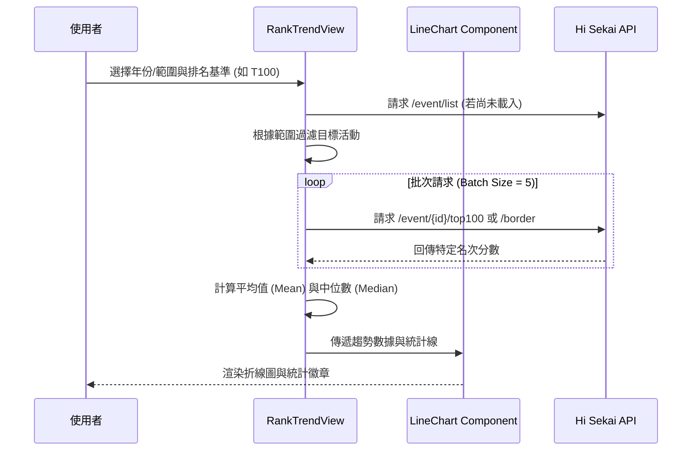

# 📄 頁面規格說明書 - 活動榜線趨勢 (Rank Trend)

**撰寫日期**: 2026-03-11
**版本號**: 1.1.0

**文件代號**: `PAGE_RANK_TREND`
**對應視圖**: `currentView === 'trend'` (src/App.tsx)
**主要用途**: 以折線圖視覺化呈現特定排名（如 Top 100）的分數隨活動期數演進的變化趨勢，分析台服環境的「內捲」程度。

---

## 1. 功能概述 (Feature Overview)

本頁面提供時間序列分析，協助玩家觀察分數線的長期走向。

### 1.1 核心功能
*   **範圍選取模式**:
    *   **全部 (All)**: 載入所有歷史活動（數據量大，需等待）。
    *   **年份 (Year)**: 選擇特定年份（如 2023, 2024）。
    *   **期數 (ID Range)**: 自訂起始與結束 ID（例如 30 ~ 50 期）。
*   **趨勢折線圖**: 繪製 `X軸: 活動期數` vs `Y軸: 分數` 的折線圖。
*   **統計輔助線**: 可開啟顯示選定範圍內的「平均值 (Mean)」與「中位數 (Median)」虛線。
*   **多維度篩選**: 即使在選定範圍內，仍可疊加 Unit / Type 等篩選器，例如「查看 2023 年所有 25 點箱活的 T100 趨勢」。

### 1.2 互動機制
*   **數據點懸停**: 滑鼠移至圖表上的點，透過 `PortalTooltip` 顯示該期活動的詳細資訊（Logo、名稱、分數），確保提示框不受圖表容器的 `overflow: hidden` 限制。
*   **點擊跳轉** (預留): 未來可實作點擊數據點跳轉至該活動詳情。

---

## 2. 技術實作 (Technical Implementation)

### 2.1 資料獲取流程 (Data Fetching Flow)
位於 `src/components/pages/RankTrendView.tsx`。

1.  **取得列表**: 初始化時先取得全活動列表 `allEvents`。
2.  **範圍過濾**: 根據使用者選擇的模式 (All/Year/ID)，篩選出 `targetEvents`。
3.  **批次請求**: 
    *   同樣採用 `BATCH_SIZE = 5` 的批次機制。
    *   針對每個目標活動，依據 `selectedRank` 決定呼叫 `/top100` 或 `/border` API。
    *   從回應中提取特定名次的分數。
4.  **錯誤處理**: 若某期活動無該名次數據（例如早期的 T10000），則該點數值為 0 或被過濾。

### 2.2 圖表繪製與統計 (Chart & Stats)
*   **數據映射**: 將 API 回傳的 `TrendDataPoint` 轉換為 `LineChart` 需要的格式。
*   **效能優化 (Performance)**:
    *   使用 `useMemo` 緩存 `chartData` 與統計結果（平均值、中位數），僅在活動列表或篩選條件變動時重新計算。
    *   使用 `useCallback` 封裝過濾邏輯，減少子組件不必要的重繪。
*   **客戶端過濾**: 
    *   API 抓取的是「該範圍內所有活動」的數據。
    *   使用者切換 Filter (如 Unit) 時，**不需要重新 Fetch**，而是直接過濾 `chartData` 中的 `isHighlighted` 屬性。
    *   被過濾掉的點會變淡 (Opacity 降低) 或隱藏，保留背景脈絡。
*   **統計運算**: 使用 `useMemo` 即時計算當前顯示數據的平均值與中位數。

---

## 3. UI/UX 排版設計 (UI Layout)

### 3.1 控制面板 (Control Panel)
*   **第一層**: 範圍模式切換器 (Tab style) 與對應的輸入控制項（年份下拉選單 / ID 輸入框）。
*   **第二層**:
    *   **排名基準**: 下拉選單選擇 T1, T10, ... T10000。
    *   **篩選器**: `EventFilterGroup` (收闔式篩選按鈕與彈跳視窗)。
    *   **輔助開關**: 右側包含「顯示輔助線」Checkbox 與 平均/中位數 的數據徽章 (Badge)。

### 3.2 圖表區域 (Chart Area)
*   使用 `LineChart` 組件，設定 `variant="trend"`。
*   **X軸**: 顯示活動 ID，且會標示年份分隔線。
*   **Y軸**: 分數（或日均分）。
*   **視覺樣式**:
    *   線條顏色預設為 Teal/Cyan。
    *   若有篩選，符合條件的點會顯示活動代表色（如 Leo/need 為藍色）。
    *   未符合條件的點顯示為灰色且半透明。
*   **RWD**: 手機版圖表高度較矮，並提示「建議橫向觀看」。

---

## 4. 模組依賴 (Module Dependencies)

*   `src/components/pages/RankTrendView.tsx` (核心視圖，使用 `useMemo` 與 `useCallback` 優化)
*   `src/components/charts/LineChart.tsx` (折線圖繪製)
*   `src/components/ui/EventFilterGroup.tsx`
*   `src/components/ui/Select.tsx`
*   `src/components/ui/Input.tsx` (ID 範圍輸入)
*   `src/hooks/useRankings.ts`
*   `src/utils/mathUtils.ts` (計算統計數據)

## 5. 序列圖 (Sequence Diagram)

