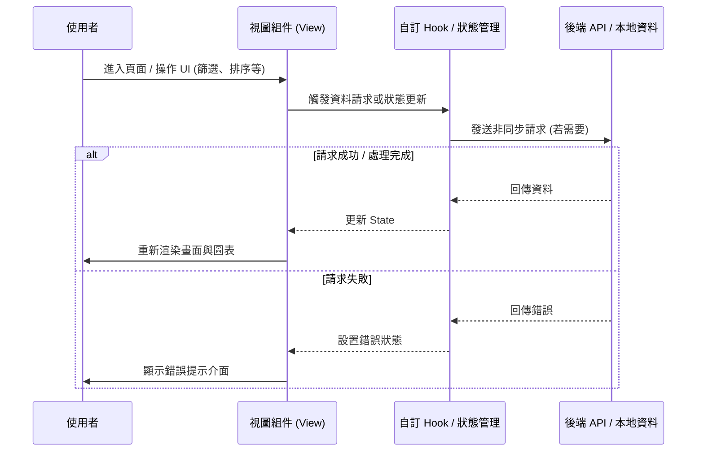

# 📄 頁面規格說明書 - 預估資源計算機 (Resource Estimator)

**撰寫日期**: 2026-03-11
**版本號**: 1.1.0

**文件代號**: `PAGE_RESOURCE_ESTIMATOR`
**對應視圖**: `currentView === 'resourceEstimator'` (src/App.tsx)
**主要用途**: 協助玩家根據歷史活動的分數線，結合自身隊伍加成與體力策略，精確估算衝榜所需的 Live Bonus 補充罐數量。

---

## 1. 功能概述 (Feature Overview)

本頁面是一個三步驟的互動式計算工具，解決「我要準備多少火罐才能打到 Top 100？」的疑問。

### 1.1 核心功能
*   **Step 1 - 基準設定 (Reference)**:
    *   從歷代活動中選擇一個性質相似（同團體、同類型）的活動作為「基準」。
    *   自動抓取該活動特定名次（如 T100）的結算分數與持續天數。
*   **Step 2 - 目標設定 (Target)**:
    *   選擇欲衝榜的「目標活動」（支援未開始、進行中或已結束的活動）。
    *   **時長校正**: 系統自動比較基準活動與目標活動的天數差異，按比例調整目標分數。
    *   **進行中活動支援**: 若目標為現時活動，自動計算「剩餘天數」並扣除「自然回體」。
*   **Step 3 - 個人參數 (Personal Specs)**:
    *   **單場 PT**: 輸入玩家目前單場獲得的分數（依實際消耗體力填寫）。
    *   **目前分數**: 若為進行中活動，可輸入已獲得分數，系統僅計算剩餘缺口。
    *   **衝榜體力策略**: 設定衝榜時預計每場消耗的體力倍率 (例如 5火、10火)。
*   **結果報告**:
    *   顯示總需場數、總需體力 (Energy)。
    *   自動扣除活動期間的自然回體。
    *   換算為具體的物品數量（大罐 + 小罐）。

### 1.2 互動機制
*   **動態校正**: 當使用者更改任一參數（如更換參考活動或調整單場分數），結果區塊即時重新計算。
*   **防呆提示**: 若輸入的單場 PT 換算回 1 火基礎分過高（> 2500 pt），顯示警告提示。

---

## 2. 技術實作 (Technical Implementation)

### 2.1 資料來源
*   **活動列表**: `/event/list` (用於選單)。
*   **分數查詢**: `/event/{id}/top100` 或 `/event/{id}/border` (取得基準分數)。

### 2.2 核心運算邏輯 (Calculation Logic)
位於 `src/components/pages/ResourceEstimatorView.tsx` 的 `result` memo。

1.  **目標分數校正**:
    $$TargetScore = BaseScore \times \frac{TargetDuration}{BaseDuration}$$
2.  **剩餘需求計算**:
    $$ScoreNeeded = TargetScore - CurrentUserScore$$
3.  **單場效率換算**:
    *   利用 `ENERGY_SCALING` 表查表 (1火=5倍, 2火=10倍... 10火=35倍)。
    *   $$EstimatedPt = \frac{InputPt}{InputEnergyScale} \times PlanEnergyScale$$
4.  **資源需求**:
    *   $$Games = \lceil \frac{ScoreNeeded}{EstimatedPt} \rceil$$
    *   $$TotalEnergy = Games \times PlanEnergy$$
    *   $$NaturalRecovery = RemainingDays \times 48$$ (每天自然回體 48 點)
    *   $$Deficit = \max(0, TotalEnergy - NaturalRecovery)$$
5.  **道具換算**:
    *   Big Cans (大罐, +10) = $\lfloor Deficit / 10 \rfloor$
    *   Small Cans (小罐, +1) = $Deficit \pmod{10}$

---

## 3. UI/UX 排版設計 (UI Layout)

### 3.1 三欄式輸入區 (Input Grid)
採用 `Card` 組件將三個步驟分組展示，在桌機版為三欄並排，手機版為垂直堆疊。

*   **Card 1 (參考)**: 包含團體篩選、活動選擇、名次選擇。下方顯示抓取到的分數與天數。
*   **Card 2 (目標)**: 目標活動選擇。若為進行中活動，會顯示「剩餘天數」與「預估總天數」的對比。
*   **Card 3 (條件)**: 
    *   輸入框: 單場 PT、使用體力。
    *   **條件式輸入**: 僅在目標為進行中活動時，出現「目前自身分數」輸入框。
    *   下拉選單: 計畫衝榜火數 (0-10)。

### 3.2 結果展示區 (Result Dashboard)
*   **狀態 A: 尚未完成設定**: 顯示引導圖示與文字。
*   **狀態 B: 目標已達成**: 若目前分數 > 目標分數，顯示綠色慶祝介面。
*   **狀態 C: 計算結果**:
    *   **左側**: 顯示校正後的目標分、總場數、自然回體抵扣量。
    *   **右側 (視覺化)**: 以大圖標顯示所需的「大罐」與「小罐」數量。
*   **全域警語**: 底部提示計算未包含升級回體與廣告回體。

---

## 4. 模組依賴 (Module Dependencies)

*   `src/components/pages/ResourceEstimatorView.tsx`
*   `src/components/ui/Card.tsx`
*   `src/components/ui/Select.tsx`
*   `src/components/ui/Input.tsx`
*   `src/utils/mathUtils.ts`
*   `src/config/config/constants.ts` (ENERGY_SCALING, calculatePreciseDuration)

## 5. 序列圖 (Sequence Diagram)

