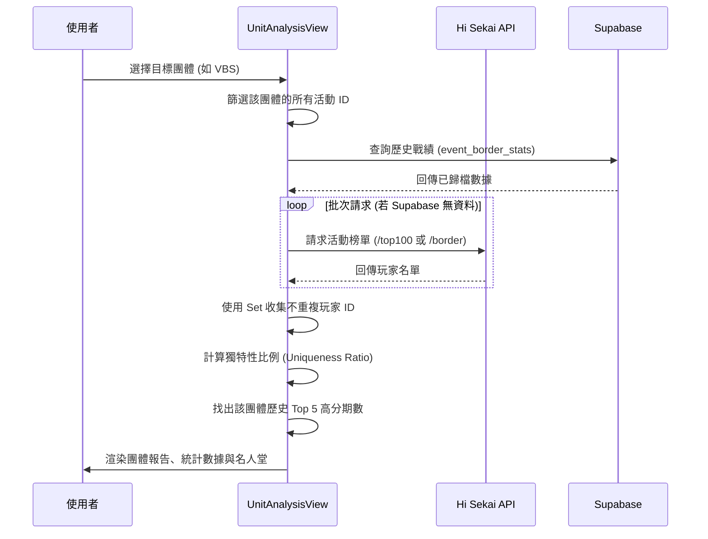

# 📄 頁面規格說明書 - 團推分析 (Unit Analysis)

**撰寫日期**: 2026-03-16
**版本號**: 2.0.0

**文件代號**: `PAGE_UNIT_ANALYSIS`
**對應視圖**: `currentView === 'unitAnalysis'` (src/App.tsx)
**主要用途**: 以「團體 (Unit)」為核心視角，整合歷代活動數據，分析特定團體的活動熱度、分數趨勢與玩家參與度。

---

## 1. 功能概述 (Feature Overview)

本頁面協助「箱推」玩家了解自己喜愛的團體在歷史上的競爭定位。

### 1.1 核心功能
*   **團體切換**: 支援 6 個團體 (L/n, MMJ, VBS, WxS, 25, VS) 與 Mix 活動的切換。
*   **劇情類型過濾**: 可區分「箱活 (Unit Event)」與「World Link」。
*   **名次基準**: 可選擇分析 T1, T10, T100... T10000 的數據。
*   **統計摘要**:
    *   **獨特性分析 (Uniqueness)**: 計算在該團體的所有活動中，進入前百名的玩家「不重複率」。數值越低代表「牌位固化」（都是同一群人在打），數值越高代表「流動性高」。
    *   **基礎統計**: 計算該團體活動分數的 MAX, MEAN, MEDIAN, MIN, STD DEV。
*   **名人堂**: 列出該團體歷史上分數最高的 Top 5 期數與分數。

---

## 2. 技術實作 (Technical Implementation)

### 2.1 資料處理流程
位於 `src/components/pages/UnitAnalysisView.tsx`。

1.  **篩選 (Filtering)**: 遍歷 `allEvents`，比對 `eventDetails` 中的 `unit` 與 `storyType` 欄位。
2.  **資料獲取 (Data Fetching)**: 
    *   **歷史戰績**: 優先從 **Supabase** (`event_border_stats`) 查詢已歸檔的活動排名資料。
    *   **API 補強**: 若 Supabase 無資料，則發起對 Hi Sekai API 的請求。
3.  **玩家集合計算**:
    *   使用 `Set<string>` 收集所有曾經進入 Top 100 的 `userId`。
    *   `Unique Players` = `Set.size`。
    *   `Uniqueness Ratio` = `Unique Players / (Event Count * 100)`。

### 2.2 視覺主題
*   **動態配色**: 頁面邊框、按鈕、文字顏色會根據選中的團體自動切換（例如選 Leo/need 變藍色，選 VBS 變粉紅色）。
*   由 `src/config/config/constants.ts` 中的 `UNIT_MASTER` 提供顏色代碼。

---

## 3. UI/UX 排版設計 (UI Layout)

### 3.1 頂部選擇器
*   一排團體 Logo 按鈕。選中時圖標放大並顯示底部光條。
*   下方顯示一段動態生成的「文字報告」，將統計結果（總期數、不重複玩家數、比例）融入句子中。

### 3.2 內容網格
*   **左側 (統計區)**:
    *   控制面板: 劇情類型與名次按鈕。
    *   數據卡片: 垂直排列的統計數據卡 (Max/Mean/Median...)。
*   **右側 (紀錄區)**:
    *   顯示該團體分數最高的 5 次活動。
    *   每個項目顯示：排名(1-5)、活動 Logo、活動名稱、分數。

---

## 4. 模組依賴 (Module Dependencies)

*   `src/components/pages/UnitAnalysisView.tsx`
*   `src/lib/supabase.ts` (Supabase 客戶端)
*   `contexts/ConfigContext.ts`
*   `src/utils/mathUtils.ts` (統計運算)
*   `src/config/config/constants.ts` (團體定義與顏色)

## 5. 序列圖 (Sequence Diagram)

