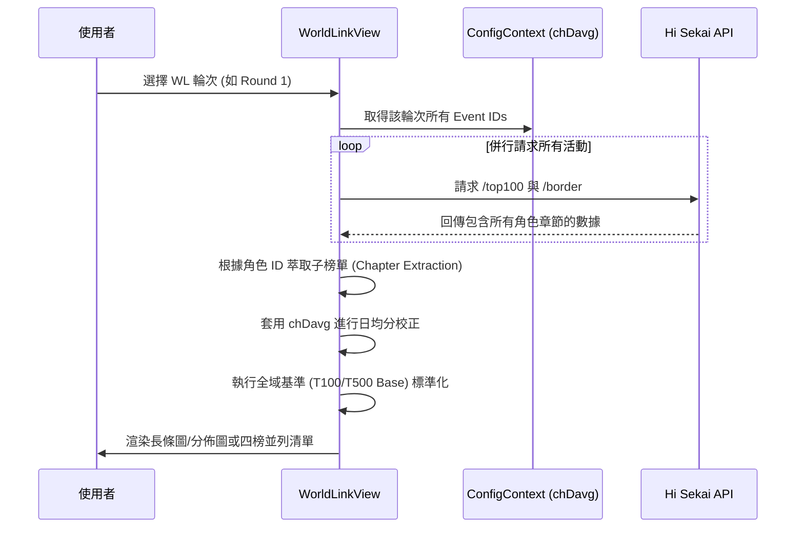

# 📄 頁面規格說明書 - World Link 分析 (World Link Analysis)

**撰寫日期**: 2026-03-11
**版本號**: 1.1.0

**文件代號**: `PAGE_WORLD_LINK`
**對應視圖**: `currentView === 'worldLink'` (src/App.tsx)
**主要用途**: 專為「World Link」這一特殊活動類型設計的綜合分析看板，解決傳統榜單無法直觀比較各章節（角色）熱度的問題。

---

## 1. 功能概述 (Feature Overview)

World Link 活動將一次活動拆分為多個章節 (Chapters)，每個章節對應不同角色且天數可能不同。本頁面旨在標準化這些數據以進行公平比較。

### 1.1 核心功能
*   **輪次切換**: 支援切換「第一輪 (Round 1)」、「第二輪 (Round 2)」與「第三輪 (Round 3)」的 World Link 活動群組。
*   **日均分校正 (Daily Average Correction)**:
    *   由於 WL 各章節持續天數可能不同（例如第 140 期某些章節為 2 天，其餘多為 3 天），系統會讀取設定檔中的 `chDavg` 進行權重校正。
    *   提供「總分 (Total)」與「日均 (Daily)」兩種視角。
*   **雙模式圖表**:
    *   **活躍度模式 (Activity)**: 以橫向長條圖比較各角色的絕對分數。可選擇比較 Top 1, Top 10, Top 100 或特定邊線 (Border)。
    *   **全域顯示 (Global)**: 以 **T100** 或 **T500** 為基準線 (Base)，將各角色的 T200/T300...T10000 分數標準化為百分比，視覺化呈現「競爭熱度分佈」。
*   **四榜並列 (Table Mode)**: 同時展示 Top 1, Top 10, Top 100, 及自選 Border (如 T1000) 的排名列表。

### 1.2 互動機制
*   **基準切換**: 在全域圖表模式下，可切換 Base Line (T100 或 T500)，以適應不同熱度的觀察需求。
*   **幾何標記**: 在全域圖表中，使用不同形狀的幾何圖形 (圓形、方形、三角形等) 代表不同名次，滑鼠懸停可查看具體分數。
*   **視圖切換**: 可在「圖表分析 (Chart)」與「排行榜 (Table)」之間快速切換。
*   **手機版優化**: 在手機版上，圖表中的角色名稱預設隱藏，以最大化長條圖顯示空間，懸停時會顯示角色名稱。

---

## 2. 技術實作 (Technical Implementation)

### 2.1 資料結構與獲取
位於 `src/components/pages/WorldLinkView.tsx`。

*   **設定檔依賴**: 高度依賴 `ConfigContext` 中的 `wlDetails` 與 `getWlIdsByRound`。
*   **聚合邏輯 (Aggregation)**:
    1.  根據選定的 Round (1, 2, 3) 取得所有相關 Event IDs。
    2.  並行請求每個 Event 的 `/top100` 與 `/border`。
    3.  從 API 回傳的 `userWorldBloomChapterRankings` 與 `userWorldBloomChapterRankingBorders` 中，提取各角色的子榜單數據。
    4.  將數據展平 (Flatten) 為 `AggregatedCharStat` 陣列，包含角色名稱、顏色、所屬期數、各名次分數、持續時間與章節順序。
*   **進度回饋**: 由於需同時請求多個活動數據，介面會顯示讀取進度條 (Loading Progress)。

### 2.2 圖表渲染邏輯
*   **HorizontalBarChart (Activity Mode)**:
    *   單純的長條圖，依據選定的 Metric (如 Top 100) 排序。
    *   顯示角色頭像與分數。
*   **GlobalScoreChart (Global Mode)**:
    *   **標準化**: `Value = (TargetScore / BaseScore) * 100%`。
    *   **Rank Shape**: 使用 SVG 繪製不同形狀代表不同名次：
        *   T200: 圓形
        *   T300: 正方形
        *   T400/T500: 三角形/倒三角形
        *   T1000+: 多邊形與星形
    *   **Scatter Ranks**:
        *   若 Base 為 T100，顯示 T200, T300, T400, T500, T1000。
        *   若 Base 為 T500，顯示 T1000, T2000, T5000, T10000, T50000。

---

## 3. UI/UX 排版設計 (UI Layout)

### 3.1 控制儀表板 (Control Dashboard)
*   **左側 (Data Settings)**:
    *   **輪次選擇**: 下拉選單 (Round 1/2/3)。
    *   **分數模式**: 總分 / 日均 (Pills 切換)。
*   **右側 (View Mode)**:
    *   圖表分析 / 排行榜 (Toggle Buttons)。

### 3.2 圖表區 (Chart View)
*   **子控制列**:
    *   切換 Activity / Global 模式。
    *   Activity 模式下：選擇 Metric (Top 1 ~ T10000)。
    *   Global 模式下：選擇 Base (T100 / T500)。
*   **視覺呈現**:
    *   使用角色代表色作為長條圖背景色（半透明）。
    *   右側預留空間顯示數值與頭像。

### 3.3 列表區 (Table View)
*   採用 RWD Grid 佈局 (1欄 -> 2欄 -> 4欄)。
*   分別顯示 Top 1, Top 10, Top 100, 自選 Border。
*   **Row 樣式**:
    *   前三名高亮 (金/紫/青)。
    *   顯示角色名稱、Event ID 與 Chapter Order (Ch.X)。
    *   分數靠右對齊，支援千分位顯示。

---

## 4. 模組依賴 (Module Dependencies)

*   `src/components/pages/WorldLinkView.tsx`
*   `contexts/ConfigContext.ts` (提供 WL 詳細設定)
*   `src/components/ui/DashboardTable.tsx`
*   `src/components/ui/Select.tsx`
*   `src/hooks/useRankings.ts` (fetchJsonWithBigInt)
*   `src/config/uiText.ts`

## 5. 序列圖 (Sequence Diagram)

