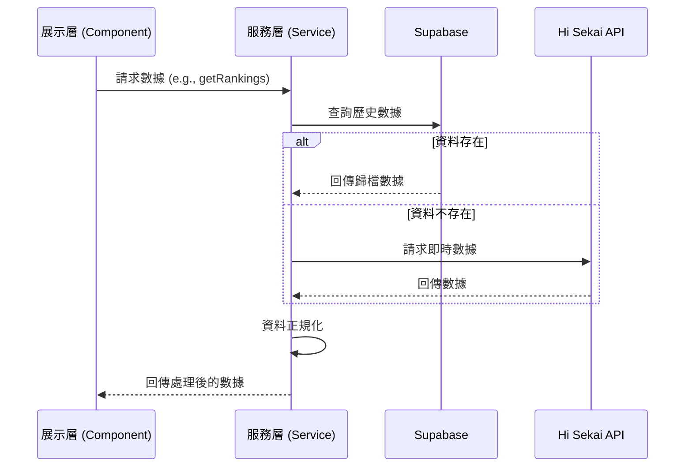

# 📄 服務層規格說明書 (Services Specification)

**撰寫日期**: 2026-03-16
**版本號**: 2.0.0

本文件詳細說明 **Hi Sekai TW** 服務層的架構與各模組職責。服務層分為 **前端服務層 (`src/services/`)** 與 **後端服務層 (`lib/`)**，負責與外部資料來源 (Supabase, Hi Sekai API) 進行互動，並將處理後的資料提供給展示層 (Presentation Layer) 或 API 端點使用。

## 1. 架構概述

服務層採用 **解耦設計**，將 API 請求、資料正規化與業務邏輯封裝於獨立的服務類別或函式中。
*   **前端服務層**：處理 React 組件直接使用的邏輯（如卡片快取）。
*   **後端服務層**：處理 API Routes 使用的邏輯，符合 Vercel Serverless Functions 的部署規範，使用根目錄 `lib/` 以優化 Function 數量。

## 2. 服務模組詳解

### 2.1. 前端服務層 (`src/services/`)

| 服務名稱 | 檔案路徑 | 職責說明 |
| :--- | :--- | :--- |
| **CardService** | `src/services/cardService.ts` | 處理卡片資料的獲取與轉換，包含卡片屬性、技能與數值解析。 |
| **FeatureFlagService** | `src/services/featureFlagService.ts` | 管理頁面功能開關與實驗性功能。 |

### 2.2. 後端服務層 (`api/_lib/`)
這些核心微服務模組處理大部分 Vercel API Routes 的底層邏輯。為維持職責分離與安全管理，這些模組具備了「完全分離的獨立架構規格書」，深入剖析其方法調用與資料流。請點選下方連結參閱細節：

| 服務模組配置 | 規格書引導 (Specification Docs) | 核心職責概述 |
| :--- | :--- | :--- |
| **RankingsService** | [SERVICE_RANKINGS_SERVICE.md](./SERVICE_RANKINGS_SERVICE.md) | 「大一統 API」的核編層，合併 Top100 與邊界。 |
| **StatsService** | [SERVICE_STATS_SERVICE.md](./SERVICE_STATS_SERVICE.md) | 背景批量聚合演算法、統計與降級聚合防護。 |
| **EventsService** | [SERVICE_EVENTS_SERVICE.md](./SERVICE_EVENTS_SERVICE.md) | 活動目錄建立與外部資料的 Upsert 排程同步。 |
| **DataService** | [SERVICE_DATA_SERVICE.md](./SERVICE_DATA_SERVICE.md) | 對外接口的純文字轉拋 Proxy（繞過跨域）。 |
| **HisekaiClient** | [SERVICE_HISEKAI_CLIENT.md](./SERVICE_HISEKAI_CLIENT.md) | 外部連線的守門機制、解析防溢位與大數轉錄。 |
| **SupabaseClient** | [SERVICE_SUPABASE_CLIENT.md](./SERVICE_SUPABASE_CLIENT.md) | 高層級寫入 (Service Role) 安全節點。 |

## 3. 視圖鉤子層橋接 (React Hooks Layer)
請注意，前端取得與消化 API Server 資源的最前線統一被封裝在自訂鉤子之中。
由於本專案仰賴即時與巨量呈現，鉤子必須掌握本地快取的重任。
*   👉 **請參閱**: [HOOKS_SPECIFICATION.md](./HOOKS_SPECIFICATION.md) 了解 `useRankings` 與 `useEventList` 這兩大統馭畫面的狀態引擎其結構與生命週期綁定方式。

## 3. 資料獲取策略 (Data Fetching Strategy)

本專案採用 **混合資料來源策略**：

1.  **優先查詢 Supabase**: 對於歷史戰績、歸檔資料，優先從 Supabase 查詢。
2.  **API 補強**: 若 Supabase 無資料，則降級請求 Hi Sekai API。
3.  **資料正規化**: 所有服務層函式回傳的資料皆會經過正規化處理，確保格式一致，方便展示層使用。

## 4. 序列圖範例 (Sequence Diagram)

