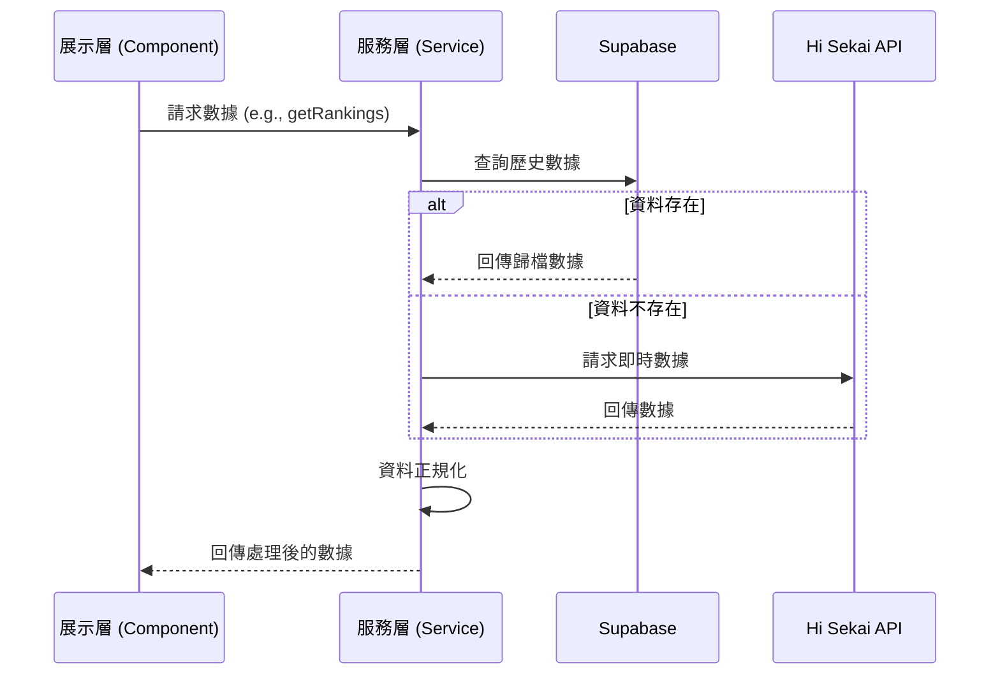

# 📄 服務層規格說明書 (Services Specification)

**撰寫日期**: 2026-03-16
**版本號**: 2.0.0

本文件詳細說明 **Hi Sekai TW** 服務層 (`src/services/`) 的架構與各模組職責。服務層是應用程式的資料獲取與業務邏輯核心，負責與外部資料來源 (Supabase, Hi Sekai API) 進行互動，並將處理後的資料提供給展示層 (Presentation Layer) 使用。

## 1. 架構概述

服務層採用 **解耦設計**，將 API 請求、資料正規化與業務邏輯封裝於獨立的服務類別或函式中，確保視圖層 (View Layer) 不需直接處理底層 API 的複雜細節。

## 2. 服務模組詳解

| 服務名稱 | 檔案路徑 | 職責說明 |
| :--- | :--- | :--- |
| **CardService** | `src/services/cardService.ts` | 處理卡片資料的獲取與轉換，包含卡片屬性、技能與數值解析。 |
| **DataService** | `src/services/dataService.ts` | 處理基礎資料（如團體、角色）的讀取，提供全域基礎設定。 |
| **EventsService** | `src/services/eventsService.ts` | 處理活動列表與活動詳情的獲取，包含活動類型、時間區間與關聯資料。 |
| **FeatureFlagService** | `src/services/featureFlagService.ts` | 管理頁面功能開關與實驗性功能，根據環境變數或資料庫設定控制功能可見性。 |
| **RankingsService** | `src/services/rankingsService.ts` | 處理榜單數據（Top100/Border）的獲取與正規化，整合 Supabase 與 Hi Sekai API 資料。 |
| **StatsService** | `src/services/statsService.ts` | 處理統計運算（如日均分、不重複率、競爭陡峭度）與資料分析演算法。 |

## 3. 資料獲取策略 (Data Fetching Strategy)

本專案採用 **混合資料來源策略**：

1.  **優先查詢 Supabase**: 對於歷史戰績、歸檔資料，優先從 Supabase 查詢。
2.  **API 補強**: 若 Supabase 無資料，則降級請求 Hi Sekai API。
3.  **資料正規化**: 所有服務層函式回傳的資料皆會經過正規化處理，確保格式一致，方便展示層使用。

## 4. 序列圖範例 (Sequence Diagram)

