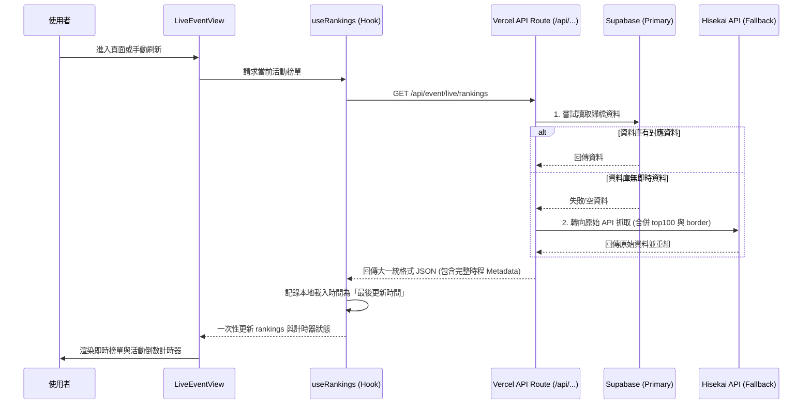

# 📄 頁面規格說明書 - 現時活動 (Live Event)

**撰寫日期**: 2026-04-03
**版本號**: 1.3.0

**文件代號**: `PAGE_LIVE_EVENT`
**對應視圖**: `currentView === 'live'` (src/components/pages/LiveEventView.tsx)
**主要用途**: 提供正在進行中的活動即時排名資訊、競爭數據分析與預測。
**API 依賴**: 
*   `/api/events/list`
*   `/api/events/:id`
*   `/api/event/live/rankings`
*(詳細規格請參照 `/docs/architecture/API_ARCHITECTURE.md`)*

---

## 1. 功能概述 (Feature Overview)

本頁面是使用者進入應用程式後的第一個核心功能，旨在提供「戰場最前線」的即時資訊。

### 1.1 核心功能
*   **即時榜單查詢**: 顯示 Top 100 玩家的即時分數、名稱、隊伍資訊。
*   **World Link 章節切換**: 若當前活動為 World Link 類型，支援切換「總榜」與各角色的「個人章節」排行榜。
*   **角色頭像顯示**: 顯示玩家隊長卡片的 Q 版角色頭像。
*   **精彩片段 (Highlights)**: 切換模式查看特定邊線名次（T200, T500, T1000…）分數。
*   **倒數計時**: 顯示距離結算的剩餘時間；WL 章節會動態切換為章節自身的結束時間。
*   **競爭數據儀表板**: 自動計算區間倍率、差值與 T50-T100 CV。
*   **玩家活躍狀態指示器** *(新增，僅限現時活動)*:
    *   **綠點 (Online)**: 若玩家最後上線時間距今 ≤ 2 分鐘，在頭像右下角顯示 `animate-pulse` 綠點。
    *   **月亮休息條 (Rest Bar)**: 若玩家最後上線時間距今 > 2 分鐘，在玩家名稱下方顯示月亮 🌙 icon + 品牌色進度條（0-24h 刻度）+ 離線時間文字標籤，讓觀察者直觀判斷對手是否在線。
*   **安全線/死心線**: 計算並顯示理論安全與放棄分數門檻。
*   **動態圖表**: 繪製分數分佈曲線。

### 1.2 互動機制
*   **排序切換**: 支援依「總分」、「日均分」、「最後上線時間」及「時速 (1H/3H/24H)」排序。
*   **展開詳情**: 點擊玩家卡片可展開 1H/3H/24H 詳細時速數據。
*   **模式切換（手機端）**: 在手機版排行榜標題欄嵌入切換按鈕，文字顯示「目的地」名稱（當前在前百排行榜時顯示「⚡ 精彩片段」，反之亦然），讓使用者明確知道按鈕的作用。
*   **分頁與章節解耦**: 桌面端支援分頁瀏覽；切換分頁或排序時，WL 章節選擇保留不重置。

---

## 2. 技術實作 (Technical Implementation)

### 2.1 資料來源 (Data Fetching)
本頁面主要依賴 `src/hooks/useRankings.ts` 進行資料管理。

| 資料類型 | API 端點 | 觸發時機 | 備註 |
| :--- | :--- | :--- | :--- |
| **大一統即時榜單** | `/event/live/rankings` | 頁面首次載入與手動刷新時 | 一次性回傳 Top 100 與所有邊線資料，消除非同步競態問題 |

### 2.2 核心邏輯 (Core Logic)

#### A. 安全線與死心線公式
位於 `src/components/shared/RankingItem.tsx` 與 `src/components/charts/ChartAnalysis.tsx`。

```typescript
const maxGainPerSec = 68000 / 100; // 假設極限理論值：每 100 秒獲得 6.8 萬分 (獨奏極限)
const maxGain = remainingSeconds * maxGainPerSec;

// 安全線：當前分數 + 剩餘時間理論最大增幅
const safeThreshold = currentScore + maxGain;

// 死心線：目標分數 - 剩餘時間理論最大增幅
const giveUpThreshold = targetScore - maxGain;
```

#### B. 競爭數據計算
位於 `src/components/pages/LiveEventView.tsx` 的 `competitiveStats` memo。
*   計算特定名次間的倍率 (Ratio) 與差值 (Diff)。
*   利用 `src/utils/mathUtils.ts` 計算變異係數 (CV)，數值越低代表分數分佈越平均（競爭越膠著）。

#### C. 狀態管理與特殊邏輯
*   **`useRankings`**: 封裝了單一 `fetch` 邏輯，並保證了資料同步防呆機制（特別是透過 `closed_at` 映射確保計時器能在空窗期時穩定掛載）。
*   **最後更新時間 (Last Updated)**: 強制定義為「使用者發出請求並成功取得響應的**本機當下時間**」，確保真實反映前端資料快照時間，而非後端伺服器的聚合時間。
*   **`currentPage`**: 控制顯示一般榜單 (number) 或是精彩片段 ('highlights')。進入精彩片段模式時，統一從 `sortedAndFilteredRankings` 中過濾掉第 1 至 99 名。

#### D. WL 歷史分數整合 (Phase 2 新增)
*   邏輯位於 `src/contexts/ConfigContext.tsx` 的 `getPrevRoundWlChapterScore(eventId, charId)` 函式。
*   **查找規則**：
    *   若現為**第 2 輪以後**的章節：透過 `WorldLinkDetail.json` 查找上一輪 (round - 1) 中，包含相同角色 charId 的活動 ID，再從 `wlStats` 快取中取得其歷史邊線分數。
    *   若現為**第 1 輪**：目前無上一輪可參考，邏輯回傳 `null`（不顯示歷史線）。
*   **傳遞鏈**：`ConfigContext.getPrevRoundWlChapterScore` → `ChartAnalysis`（接收 `activeChapterId` prop）→ `LineChart`（接收 `historicalLine` prop）。
*   **UI 儀表板標籤**：在圖表標題列常駐顯示上輪 T1 / T10 / T100 分數文字標籤，顏色套用當前章節角色代表色。

---


## 3. UI/UX 排版設計 (UI Layout)

頁面採用垂直流式佈局，由上而下分為三個主要區塊。

### 3.1 頁面頭部 (Header Section)

#### 手機版 (`< sm`, < 640px)
呈現緊湊式單卡設計，最小化垂直高度：

```
┌───────────────────────────────────────────┐
│ [小圖] 活動名稱（最多兩行，溢出截斷）      │
│        00日:00時:00分 · 更新 09:42:01     │
├───────────────────────────────────────────┤
│ (競爭數據統計) T1/T10 倍率 等             │
└───────────────────────────────────────────┘
```
*   **第一行**: 小型活動圖 (h-10) + 活動名稱 (`font-black text-sm line-clamp-2`)
*   **第二行**: 裸文字倒數計時 (`bare` prop，`text-[10px]`) + 分隔符 `·` + 更新時間
*   **統計區塊**: 下方獨立一欄，以 `border-t` 分隔

#### 桌面版 (`≥ sm`)
顯示完整標題「現時活動 (Live Event)」並使用 CSS Grid 水平排列：

*   **順序 (由左至右)**:
    1.  **活動圖片** (跨兩列)
    2.  **活動名稱** (上) / **最後更新時間** (下)
    3.  **倒數計時器** (帶外框樣式，跨兩列)
    4.  **競爭數據** (跨兩列，最右側)

### 3.2 圖表分析區 (Chart Section) - 可折疊
*   使用 `CollapsibleSection` 包覆。
*   **組件**: `ChartAnalysis.tsx` -> `LineChart.tsx`。
*   **視覺**:
    *   **X軸**: 排名 (Rank)。
    *   **Y軸**: 分數 (Score)。
    *   **輔助線**: 繪製「安全區 (綠色背景)」與「死心區 (紅色背景)」。
    *   **互動**: 懸停於圖表點可查看該名次的具體分數與玩家名稱。

### 3.3 排行榜列表區 (Ranking List Section) - 可折疊
*   使用 `CollapsibleSection` 包覆，標題依狀態動態變更。
*   **標題欄 (CollapsibleSection Title)**:
    *   文字依模式動態顯示：「前百排行榜 (Top 100 Rankings)」或「精彩片段 (Highlights)」。
    *   **手機端**：標題欄嵌入小型切換按鈕（`sm:hidden`），文字顯示目的地名稱；WL 活動則保持「標題+按鈕」在第一行，章節 Tabs 在下一行，兩者不衝突。
    *   **桌面端**：標題欄為純文字，切換功能由下方 `Pagination` 的「精彩片段」按鈕負責。
*   **控制列**:
    *   **手機端**: 完全省略 `Pagination` 元件，僅顯示 `SortSelector`（下拉排序）。切換由標題欄按鈕控制。
    *   **桌面端**: 保留 `Pagination`（數字分頁 + 精彩片段按鈕）與 `SortSelector`。
*   **列表捲動行為**:
    *   **手機端**: 取消分頁，一次顯示最多 100 筆（`slice(0, 100)` 避免 border entries 混入）。使用者直接垂直滾動瀏覽。
    *   **桌面端**: 保留分頁，每頁 20 筆。
*   **列表內容 (`RankingList` / `RankingItem`)**:
    *   **字體密度（手機端）**: 名次 `text-sm`、名稱 `text-xs`、頭像 `w-7 h-7`，整體比桌面端降一個字級以提升密度。
    *   **安全線/死心線**: 直立手機亦可見（移除 `hidden sm:flex` 限制）。
    *   **玩家活躍狀態（僅 isLiveEvent 時）**:
        *   **線上 (≤ 2 min)**: 頭像右下角出現 `animate-pulse` 綠色小圓點。
        *   **離線 (> 2 min)**: 玩家名稱下方出現月亮 🌙 + 水平進度條（0-24h）+ 離線時間標籤（如「3h」、「45m」）。
    *   **展開圖標**: 僅在 `isClickable = true` 時渲染容器（精彩片段模式下整個 `<div>` 不渲染），消除右側死區空間。
    *   **展開詳情**: 點擊後向下滑出，顯示 1H / 3H / 24H 數據卡片。

---

## 4. 模組依賴 (Module Dependencies)

### 4.1 資料來源 (Data Fetching)
*   **大一統即時榜單**: `/event/live/rankings`
*   **外部資源**:
    *   **卡片對照表**: `cards.json` (GitHub Raw)
    *   **角色圖片**: `Chibi/{characterId}.png` (GitHub Raw)

### 4.2 狀態管理
*   **`useRankings`**: 管理榜單數據與快取。
*   **`useMobile`** *(新增)*: 統一 640px 斷點偵測 Hook，控制分頁顯隱、資料切片、手機端 Header 版本。
*   **`cardService`**: 管理卡片資料的獲取與快取 (`useCardData`)。

*   `src/components/pages/LiveEventView.tsx` (主容器)
*   `src/components/shared/RankingList.tsx`
*   `src/components/shared/RankingItem.tsx`
*   `src/components/shared/StatsDisplay.tsx`
*   `src/components/charts/ChartAnalysis.tsx`
*   `src/components/charts/LineChart.tsx`
*   `src/components/ui/Pagination.tsx`
*   `src/components/ui/SortSelector.tsx`
*   `src/components/ui/CollapsibleSection.tsx`
*   `src/components/ui/EventHeaderCountdown.tsx` *(新增 `bare` prop)*
*   `src/components/ui/CountdownTimer.tsx`
*   `src/hooks/useRankings.ts`
*   `src/hooks/useMobile.ts` *(新增)*
*   `src/utils/mathUtils.ts`
*   `src/config/uiText.ts`

## 5. 序列圖 (Sequence Diagram)



