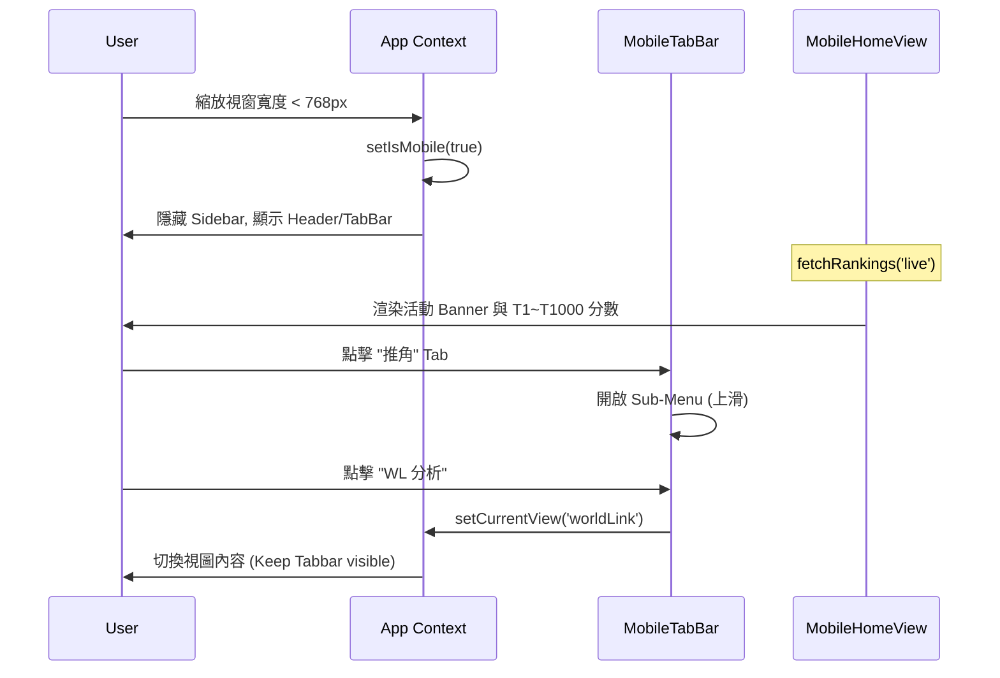

# 📄 頁面規格說明書 - 手機版 UI 與首頁 (Mobile UI & Home)

**撰寫日期**: 2026-06-26
**版本號**: 1.2.0

**文件代號**: `PAGE_MOBILE_HOME`
**對應視圖**: `isMobile === true` (src/App.tsx)
**主要用途**: 針對行動端使用者設計的專屬入口與導覽系統，提供底部 Tab Bar 快截操作與即時活動數據摘要。

---

## 1. 功能概述 (Feature Overview)

本改動將原有的側邊欄漢堡選單替換為符合行動裝置單手操作邏輯的底部導覽列，並針對首頁進行重新設計，使其在小螢幕上能直觀呈現最重要的榜線數據。

### 1.1 手機版首頁 (Mobile Home View)
*   **即時活動摘要**: 顯示當前活動 Banner、活動名稱。為提升資訊密度，將倒數計時與最後更新時間合併於同一行顯示。
*   **World Link 章節感知**: 若為 WL 活動，會顯示精簡版章節切換 Tabs（僅顯示角色頭像），下方排名卡片區域會隨之切換為所選章節的即時榜線。
*   **關鍵榜位卡片**: 顯示 T1、T10、T100、T500、T1000 的即時分數與玩家名稱（WL 章節期間自動隱藏 T500/T1000 等無資料卡片）。
*   **熱門隊長統計 (零滑動 Tab)**:
    *   **分頁切換**: 提供「即時榜線分數」與「即時熱門隊長」的 Tab 切換，維持單屏高度設計。
    *   **雙重色彩映射系統**: 卡片左側發光飾條套用角色所屬團體代表色（來自 `UNITS` 常數）；卡片右側的角色名字與頭像外框則套用角色自身的代表色（來自 `CHARACTERS` 常數）。
*   **結算等待模式**: 在活動結束至結果公佈的空窗期，自動切換至統計中提示畫面。

### 1.2 全域導覽架構
*   **Mobile Header**: 顯示品牌標題與副標題簡介，整合主題切換功能。
*   **Bottom Tab Bar**: 提供 5 個主要分類，取代桌面版側邊欄。
*   **Sub-Menu Panel**: 點擊分類後上滑顯示詳細功能清單。

---

## 2. 技術實作 (Technical Implementation)

### 2.1 環境偵測 (Responsive Support)
*   位於 `src/App.tsx` 的 `isMobile` state。
*   使用 `useEffect` 監聽 `window.onresize` 事件，當寬度 < 768px 時自動切換 UI 模式，無需重新整理頁面。

### 2.2 導覽組態 (Navigation Config)
*   所有導覽項定義於 `src/config/navConfig.tsx`。
*   `NAV_GROUPS` 陣列被 `Sidebar` 與 `MobileTabBar` 共同引用，確保導覽邏輯一致性。

### 2.3 數據對接
*   `MobileHomeView` 引用 `useRankings('live')` Hook。
*   **熱門隊長數據**：引用 `src/services/cardService.ts` 的 `useCardData` 載入卡片資料。並使用 `useMemo` 過濾並統計 Top 100 榜單中各角色的隊長卡片使用次數與佔比，生成前五名榜單。
*   自動偵測時間戳：
    *   `isEventActive`: 當前時間 < `aggregateAt`。
    *   `isCalculating`: `aggregateAt` < 當前時間 < `rankingAnnounceAt`。

---

## 3. UI/UX 排版設計 (UI Layout)

### 3.1 底部導覽列 (Design System)
*   **磨砂玻璃**: `backdrop-blur-md` 配合 80% 透明度背景。
*   **狀態反饋**: 
    *   Active/Open: 顯示分類代表色，頂端輔以 4px 狀態圓點。
    *   Inactive: `slate-400` / `slate-500`。
*   **子選單**: 採用 `animate-slideUp` 上滑動畫，每個項目左側帶有 3px 角色主題色飾條。

### 3.2 排名卡片 (Ranking Cards)
採用《世界計畫》五大原創團體配色序列：
1.  **T1**: `blue-500` (Leo/need)
2.  **T10**: `emerald-500` (MORE MORE JUMP!)
3.  **T100**: `rose-500` (Vivid BAD SQUAD)
4.  **T500**: `orange-500` (Wonderlands × Showtime)
5.  **T1000**: `purple-500` (25ji)

### 3.3 熱門隊長卡片 (Leader Cards)
*   **雙重色彩樣式**：
    *   左側邊發光條套用所屬團體代表色（例如宵崎奏屬於 25ji，顯示深紫色）。
    *   右側的角色名字與頭像外框套用角色個人代表色（例如宵崎奏顯示紅棕色）。
*   **排列與高度**：限制為前 5 名。在 RWD 下維持與分數卡片一致的高度，確保整體介面符合「零滑動」的設計原則。

---

## 4. 模組依賴 (Module Dependencies)

*   `src/App.tsx`: 負責 RWD 狀態分發與 View 路由切換。
*   `src/components/layout/MobileHeader.tsx`: 頂部品牌列。
*   `src/components/layout/MobileTabBar.tsx`: 底部導覽與子面板。
*   `src/components/pages/MobileHomeView.tsx`: 手機首頁主內容。
*   `src/config/navConfig.tsx`: 導覽與色彩元數據。
*   `src/services/cardService.ts`: 提供卡片元數據查詢 (`useCardData`)。
*   `src/hooks/useRankings.ts`: 串接排名與活動時間數據。

---

## 5. 序列圖 (Sequence Diagram)

