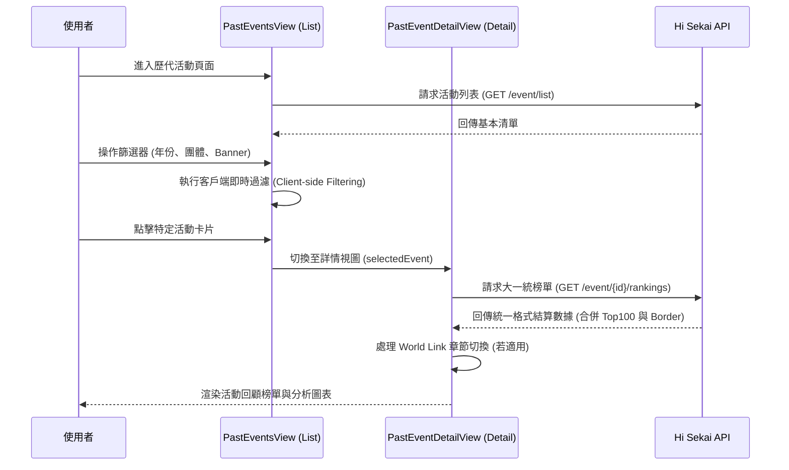

# 📄 頁面規格說明書 - 歷代活動 (Past Events)

**撰寫日期**: 2026-04-03
**版本號**: 1.3.0

**文件代號**: `PAGE_PAST_EVENTS`
**對應視圖**: `currentView === 'past'` (src/components/pages/PastEventsView.tsx & src/components/pages/PastEventDetailView.tsx)
**主要用途**: 提供完整的歷史活動資料庫，支援多維度搜尋、篩選與回顧詳細榜單。
**API 依賴**: 
*   `/api/events/list`
*   `/api/events/:id`
*   `/api/event/:id/rankings`
*(詳細規格請參照 `/docs/architecture/API_ARCHITECTURE.md`)*

---

## 1. 功能概述 (Feature Overview)

本頁面是應用程式的歷史檔案館，允許使用者瀏覽並查詢自遊戲開服以來的所有活動數據。

### 1.1 核心功能
*   **活動列表總覽**: 以卡片網格 (Grid) 形式展示所有歷史活動。
*   **多維度篩選 (Multi-dimensional Filtering)**:
    *   **基本篩選**: 年份 (Year)、團體 (Unit)。
    *   **進階篩選**: 活動類型 (Marathon/Carnival/WL)、劇情類型 (箱活/混活)、Banner 主角、卡池類型 (常駐/限定/FES)、四星卡角色。
*   **排序功能**: 支援依「活動期數 (ID)」或「活動天數 (Duration)」進行升冪/降冪排序。
*   **狀態標示**: 自動標記活動狀態（已結束、進行中、結算中），但僅「已結束」的活動可點擊進入查看結算榜單。
*   **活動詳情回顧**: 點擊特定活動後，進入與「現時活動」相同的榜單介面，但數據鎖定為該期最終結果。

### 1.2 World Link 特殊處理
*   在列表視圖中，World Link 活動會顯示特殊的標籤與 Banner 呈現方式（多角色頭像）。
*   進入詳情後，會自動偵測並顯示 **「章節切換 (Chapter Tabs)」**，允許使用者查看總榜或特定角色的章節排名。

---

## 2. 技術實作 (Technical Implementation)

### 2.1 資料來源 (Data Fetching)

| 資料類型 | API 端點 | 觸發時機 | 備註 |
| :--- | :--- | :--- | :--- |
| **活動列表** | `/event/list` | 頁面載入時 | 回傳包含 ID、名稱、時間的基本清單 |
| **詳細設定** | `eventDetail.json` | App 初始化時 (ConfigContext) | 補足 API 缺少的資訊 (Banner, Unit, CardType 等) |
| **大一統歷史榜單** | `/event/{id}/rankings` | 點擊特定活動卡片進入詳情後 | 一次性取得該期 Top 100 與所有邊線結算數據，包含章節解析 |

### 2.2 核心邏輯 (Core Logic)

#### A. 客戶端篩選 (Client-side Filtering)
位於 `src/components/pages/PastEventsView.tsx` 的 `filteredEvents` memo。
*   系統一次性載入所有活動列表，所有篩選與排序皆在前端即時運算，確保流暢體驗。
*   **邏輯流程**: 
    1.  原始列表 -> 關鍵字搜尋 (Search Term)
    2.  -> 屬性篩選 (Unit, Type, etc. 對照 `eventDetails`)
    3.  -> 四星卡篩選 (解析 `4starcard` 字串)
    4.  -> 年份篩選
    5.  -> 排序 (ID 或 Duration)

#### B. 狀態判斷
位於 `src/config/config/constants.ts` 的 `getEventStatus`。
*   比較 `start_at`, `aggregate_at`, `closed_at`, `ranking_announce_at` 與當前時間。
*   **Live/Aggregating**: 卡片顯示動態標籤，有點擊限制或特殊提示。
*   **Past**: 卡片可點擊，進入詳情模式。

#### C. 詳情模式路由 (Detail View Routing)
*   本頁面由 `App.tsx` 中的 `selectedEvent` 狀態控制顯示內容：
    *   `selectedEvent === null`: 渲染 `PastEventsView`，顯示活動列表與篩選器。
    *   `selectedEvent !== null`: 渲染 `PastEventDetailView`，顯示「返回按鈕」與該活動的 `RankingList` / `ChartAnalysis`。

---

## 3. UI/UX 排版設計 (UI Layout)

### 3.1 列表模式 (List Mode)
*   **控制區 (Controls)**:
    *   **頂部**: 標題、總數統計、搜尋欄。
    *   **年份列**: 橫向捲動的年份標籤 (All, 2024, 2023...)。
    *   **篩選列**: 
        *   左側: 排序下拉選單 (ID/Duration) + 升降冪切換鈕。
        *   右側: `EventFilterGroup` 組件 (收闔式篩選按鈕與彈跳視窗)。
*   **網格區 (Grid Content)**:
    *   RWD 設計: 手機 1 欄 -> 平板 2-3 欄 -> 桌機 4-5 欄。
    *   **活動卡片 (Event Card)**:
        *   **Header**: 期數 (#123)、類型標籤 (馬拉松)、狀態標籤 (右上角)。
        *   **Body**: 活動 Logo (左)、活動名稱 (粗體)、日期範圍、持續天數。
        *   **Banner**: 顯示 Banner 角色名稱與頭像 (若為 WL 則隱藏或特殊顯示)。
        *   **Footer**: 左側顯示團體 Logo/名稱，右側顯示該期四星卡頭像陣列。

### 3.2 詳情模式 (Detail Mode)
*   **返回導航**: 頂部顯示「< 返回列表」按鈕。
*   **活動資訊 Header**:
    *   樣式與「現時活動」類似，但顯示的是該期活動的 Logo、名稱 (對應團體色)、Banner 角色。
    *   右側顯示該期活動的競爭數據 (T1/T10 差距等)。
*   **排行榜內容**:
    *   重複使用 `RankingList` 與 `ChartAnalysis` 組件。
    *   **標題欄 (CollapsibleSection Title)**:
        *   文字依模式動態顯示：「前百排行榜 (Top 100 Rankings)」或「精彩片段 (Highlights)」。
        *   **手機端**：標題欄嵌入小型切換按鈕（`sm:hidden`），文字為目的地名稱；WL 活動則「標題+按鈕」在第一行，章節 Tabs 在下一行，兩者不衝突。
        *   **桌面端**：切換功能由 `Pagination` 的「精彩片段」按鈕負責。
    *   **分頁行為**：
        *   **手機端**: 完全省略 `Pagination` 元件，一次顯示最多 100 筆（`slice(0, 100)` 避免 border entries 混入），使用者垂直滾動瀏覽。
        *   **桌面端**: 保留分頁，每頁 20 筆。
    *   **分頁與章節解耦**: 切換排行榜分頁或排序時，系統會保留當前選擇的 World Link 章節，不會重置回總榜。
    *   **角色頭像支援**: 透過資料轉換層 (`transformUserCardToPlayerInfo`)，將歷代活動的 `userCard` 格式轉換為標準格式，從而支援顯示隊長角色的 Q 版頭像。
    *   **WL 章節 Tabs**: 若為 World Link，標題列會額外出現章節切換 Tabs。在手機版 (小於 `sm` 斷點) 自動隱藏角色名稱，僅顯示頭像以優化觸控體驗。

---

## 4. 模組依賴 (Module Dependencies)

*   `src/components/pages/PastEventsView.tsx` (主容器 - 列表)
*   `src/components/pages/PastEventDetailView.tsx` (主容器 - 詳情)
*   `src/components/ui/EventFilterGroup.tsx` (篩選器群組)
*   `src/components/ui/Card.tsx`
*   `src/components/ui/SearchBar.tsx`
*   `src/components/shared/RankingList.tsx` (詳情頁復用)
*   `src/components/shared/StatsDisplay.tsx` (詳情頁復用)
*   `src/components/charts/ChartAnalysis.tsx` (詳情頁復用)
*   `src/hooks/useEventList.ts` (取得列表)
*   `src/hooks/useRankings.ts` (取得詳情)
*   `src/hooks/useMobile.ts` *(新增)*
*   `contexts/ConfigContext.ts` (提供 eventDetails 靜態資料)
*   `src/config/uiText.ts`

## 5. 序列圖 (Sequence Diagram)

